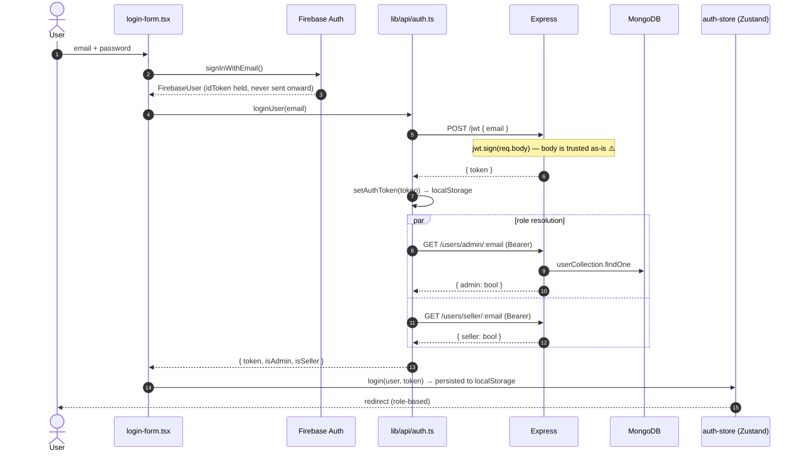

# Hossain Pharmaceuticals — Architectural Overview

> **Audit date:** 2026-08-23 · **Branch:** `modernization` @ `f0b86f9`
>
> This document describes what is **actually in the repository today**, not what the
> READMEs claim. Where the two disagree, the disagreement is called out explicitly.
> See [§5 Technical Debt & Risks](#5-technical-debt--risks) — the migration is
> **not currently in a buildable state**.

---

## 0. What This Repo Is Right Now

A **multi-vendor pharmacy e-commerce platform** mid-migration. The repository holds
two generations of the same product side by side:

| Directory | Generation | Status | Scale |
|---|---|---|---|
| `old-code/client-side` | React 18 + Vite + Material Tailwind SPA | Legacy, frozen, reference-only | ~8.2k LOC JSX |
| `old-code/server-side` | Express 4 + MongoDB monolith | **Still the live backend** — the new frontend calls it | 685 LOC, one file |
| `frontend` | Next.js 15 + TypeScript rewrite | In progress, Phases 1–7 committed | ~15k LOC TS/TSX, 109 `.tsx` |

The rewrite replaced **only the client**. The Express server was carried over
verbatim (only `.env.example` and config were added, commit `00a847f`). There is no
new backend, and no plan for one is present in the repo.

---

## 1. Tech Stack & Core Dependencies

### Runtime & Languages
- **Node.js 18+** (both tiers)
- **TypeScript 5** — `strict: true`, `noEmit`, path alias `@/* → ./*` (frontend)
- **JavaScript (CommonJS)** — backend, no types, no linting
- **JSX (untyped)** — legacy client

### Frontend (`frontend/`)
| Layer | Choice |
|---|---|
| Framework | **Next.js 15.1** App Router, Turbopack dev |
| UI runtime | **React 19** |
| Styling | **Tailwind CSS 3.4** + **shadcn/ui** (`new-york`, slate base, CSS variables) |
| Primitives | 21× `@radix-ui/react-*` |
| Server state | **TanStack Query 5** (60s `staleTime`, `refetchOnWindowFocus: false`) |
| Client state | **Zustand 5** + `persist` → `localStorage` |
| Forms | **React Hook Form 7** + **Zod 3** via `@hookform/resolvers` |
| Auth | **Firebase 11** (Auth SDK only) + hand-rolled JWT |
| Payments | **Stripe Elements** (`@stripe/react-stripe-js` 3, `stripe-js` 5) |
| Motion | Framer Motion 12, `tailwindcss-animate` |
| Theming | `next-themes` (⚠️ listed under `devDependencies` but imported by `app/providers.tsx` — a runtime dep in the wrong section) |

### Backend (`old-code/server-side/`)
Express 4 · MongoDB driver 6 (raw, no ODM) · `jsonwebtoken` 9 · `stripe` 15 · `cors` · `dotenv`

### Top 5 Critical Packages
1. **`next` 15.1** — routing, rendering, build. The whole frontend contract.
2. **`axios` 1.7** — the *only* path to data. Every read/write funnels through
   `lib/api/client.ts`; its interceptors are the sole auth-token mechanism.
3. **`zustand` 5** — holds auth identity and the cart. Because it persists to
   `localStorage`, it is also the de-facto session store.
4. **`firebase` 11** — the only real identity provider (email/password + Google).
5. **`@stripe/react-stripe-js` 3** — card capture and `confirmCardPayment`.

### Declared but Unused ⚠️
- **`next-auth@5.0.0-beta.25`** — **zero imports anywhere in the codebase.**
  Both `frontend/README.md` and the dependency list advertise "NextAuth.js v5";
  no `app/api/auth/[...nextauth]` route, no `auth.ts`, no `SessionProvider` exists.
  Auth is 100% Firebase-client + custom JWT.

---

## 2. Architecture Pattern

### Overall: **Decoupled Two-Tier Client/Server** (not a monorepo — no workspace config)

```
Browser ──HTTPS──► Next.js (render only) ──► static HTML/JS shell
   │
   └──XHR (axios, direct from browser)──► Express monolith ──► MongoDB Atlas
                                                │
                                                └──► Stripe API
```

The two tiers are joined only by `NEXT_PUBLIC_API_URL`. There is **no
Backend-for-Frontend layer** — `frontend/app/api/` does not exist. The browser
talks to Express directly, which is why the API base URL and the Firebase config
must both be `NEXT_PUBLIC_*` (client-exposed).

### Frontend: **Feature-Sliced Layered Client** (not MVC, not Clean/Hexagonal)

Four horizontal layers, cleanly separated by directory, with a strictly one-way
dependency flow:

```
app/          Routing + composition  (Next.js route groups)
   ↓
components/   Presentation           (ui/ primitives → feature folders)
   ↓
lib/stores/   Client state           (Zustand)
   ↓
lib/api/      Data access            (one module per backend resource)
   ↓
types/        Contracts              (10 domain modules, no barrel)
```

**Notable properties:**
- `lib/api/*` is a **thin anti-corruption layer**. It wraps Mongo-shaped responses
  (`_id`, `insertedId`, `modifiedCount`) in named TS types (`BackendProduct`,
  `InsertResult`, `DeleteResult`) so components never see raw driver output.
- **Business logic that belongs on the server lives in this layer instead**:
  `calculateCartSummary()` (tax 5%, free shipping ≥ $50, $5.99 flat) and
  `filterProducts()` / `sortProducts()` are pure client-side functions.
  This is a direct consequence of the backend having no query, pagination,
  or pricing endpoints.
- **Client-heavy rendering.** Only 7 files are Server Components (both root layouts,
  the two `/` pages, and the three `(auth)` pages). Every other page and 55 of 91
  components are `'use client'`. Despite the README's "✅ Server-side rendering (SSR)",
  **no page fetches data on the server** — Next.js is effectively an SPA bundler here.

### Backend: **Procedural Route Monolith**
`index.js` is a single 685-line file: 40+ route handlers registered inside one
`async run()` closure, sharing seven collection handles via lexical scope. No
controllers, services, repositories, schemas, or validation. Authorization is three
inline middleware functions (`verifyToken`, `verifyAdmin`, `verifySeller`).

---

## 3. Project Layout & Core Modules

```
hossain-pharma/
├── README.md                    ⚠️ documents the OLD stack only
├── OVERVIEW.md                  ← this file
├── .gitignore                   ⚠️ ignores MODERNIZATION_PLAN.md (plan is untracked)
│
├── frontend/                    ★ THE ACTIVE APPLICATION
│   ├── app/                     Routes (App Router)
│   │   ├── layout.tsx           ★ ROOT ENTRY — html/body, Inter font, <Providers>
│   │   ├── providers.tsx        ★ QueryClient → ThemeProvider → StoreHydration
│   │   ├── page.tsx             ⚠️ full landing page (mock data)  ─┐ COLLISION
│   │   ├── globals.css          shadcn CSS vars, light + .dark      │ both = "/"
│   │   ├── (auth)/              login · signup · forgot-password    │
│   │   ├── (main)/                                                  │
│   │   │   ├── layout.tsx       Navbar + <main> wrapper             │
│   │   │   ├── page.tsx         ⚠️ 19-line placeholder  ────────────┘
│   │   │   ├── shop/ · shop/[id]/ · category/[slug]/
│   │   │   └── cart/ · checkout/
│   │   └── (dashboard)/dashboard/
│   │       ├── layout.tsx       ★ client-side auth gate + sidebar shell
│   │       ├── page.tsx         role-based redirect dispatcher
│   │       ├── overview/ profile/ orders/            (shared)
│   │       ├── seller/products/ seller/advertisements/ (seller)
│   │       └── users/ categories/ advertisements/ all-orders/ (admin)
│   │
│   ├── lib/
│   │   ├── api/client.ts        ★ THE DATA CHOKEPOINT — axios + JWT interceptors
│   │   ├── api/{products,cart,payments,users,ads,categories,admin,auth}.ts
│   │   ├── stores/{auth,cart,ui}-store.ts   ★ Zustand, localStorage-persisted
│   │   ├── firebase/{config,auth}.ts        SDK init + 7 auth wrappers
│   │   ├── validations/auth.ts              Zod schemas (auth only)
│   │   └── mock-data/           ⚠️ 990 LOC of fake data powering the homepage
│   │
│   ├── components/
│   │   ├── ui/                  33 shadcn primitives
│   │   ├── {auth,cart,checkout,products,shop,dashboard,layout}/
│   │   ├── pages/home/          11 landing sections
│   │   ├── features/            prescription-upload · drug-interaction · vendor-comparison
│   │   ├── trust/ · animations/ · accessibility/
│   │   └── */index.ts           barrel exports per folder
│   │
│   └── types/                   10 domain contract modules
│
└── old-code/
    ├── client-side/             React 18 + Vite SPA (frozen reference)
    └── server-side/index.js     ★ THE LIVE BACKEND — 685 LOC, 40+ routes
```

### The 5 Files That Matter Most

| # | File | Why it's load-bearing |
|---|---|---|
| 1 | `old-code/server-side/index.js` | The entire API surface, data model, and authorization model. Every frontend module is shaped by its quirks (no detail endpoint, no pagination, Mongo-raw responses). |
| 2 | `frontend/lib/api/client.ts` | Single axios instance. Attaches `Bearer` from `localStorage['auth-token']` on every request; clears storage on 401. All 8 API modules import it. |
| 3 | `frontend/app/providers.tsx` | Provider composition + `StoreHydration`, which flips `isLoading→false` after first paint and triggers cart↔server sync on login. The dashboard auth gate depends entirely on this flag. |
| 4 | `frontend/lib/stores/auth-store.ts` | Identity + role + token. `persist` + `partialize` writes `user/token/isAuthenticated` to `localStorage['auth-storage']`; `onRehydrateStorage` re-arms the axios token. This *is* the session. |
| 5 | `frontend/app/(dashboard)/dashboard/layout.tsx` | The only access control in the frontend — a `useEffect` redirect on `!isAuthenticated`. |

### Entry Points

| Tier | Entry | Command |
|---|---|---|
| Frontend (prod) | `frontend/app/layout.tsx` | `npm run build && npm start` |
| Frontend (dev) | same | `npm run dev` (Turbopack) |
| Backend | `old-code/server-side/index.js` → `app.listen(PORT‖3000)` | `npm start` (or `nodemon index.js` — root README typos this as `noemon`) |
| Auth bootstrap | `lib/firebase/config.ts` — idempotent `initializeApp` guarded by `getApps().length` |

---

## 4. System Data Flow

### 4.1 Authentication & Session Bootstrap

Firebase verifies the credential; the Express server then mints its own JWT **from a
plain email in the POST body**, with no verification that Firebase actually
authenticated anyone (see [Risk #1](#-critical)).



### 4.2 Read Path — Product Listing

```
/shop (client component)
  └─ useQuery(['products'])                        TanStack Query, 60s stale
       └─ getAllProducts()                          lib/api/products.ts
            └─ apiClient.get('/products')           axios + Bearer interceptor
                 └─ Express GET /products           no auth, no pagination
                      └─ productsCollection.find().sort({createdAt:-1}).toArray()
                           └─ ⚠️ FULL COLLECTION over the wire
  └─ filterProducts() + sortProducts()             executed in the browser
```

Product detail (`/shop/[id]`) is worse: `getProductById()` re-fetches the **entire**
products collection and runs `Array.find()` client-side, because the backend exposes
no `GET /products/:id`. `getCategoryByTag()` does the same for categories.

### 4.3 Write Path — Checkout (the highest-risk flow)

```mermaid
sequenceDiagram
    autonumber
    actor U as User
    participant CO as checkout/page.tsx
    participant CS as cart-store
    participant PF as payment-form.tsx
    participant ST as Stripe
    participant OR as order-review.tsx
    participant EX as Express
    participant DB as MongoDB

    U->>CO: open /checkout
    CO->>CS: getCartSummary()
    Note over CS: subtotal + 5% tax + shipping<br/>computed CLIENT-SIDE ⚠️
    CO->>PF: amount = summary.total
    PF->>EX: POST /create-payment-intent { price }
    Note over EX: amount = parseInt(price*100)<br/>no auth, no server re-price ⚠️
    EX->>ST: paymentIntents.create()
    ST-->>EX: client_secret
    EX-->>PF: { clientSecret }
    U->>PF: card details (CardElement)
    PF->>ST: confirmCardPayment()
    ST-->>PF: paymentIntent.succeeded
    PF->>PF: sessionStorage['paymentIntentId'] = pi.id
    Note over PF,OR: 💥 MONEY HAS MOVED.<br/>No webhook exists.<br/>If the tab closes here,<br/>the order is never recorded.
    U->>OR: "Place Order"
    OR->>EX: POST /payments { price, cartIds, status:'pending' }
    Note over EX: no auth; status & price<br/>taken from client ⚠️
    EX->>DB: insertOne(payment)
    EX->>DB: cart.deleteMany({_id: {$in: cartIds.map(ObjectId)}})
    Note over EX: 💥 throws if any id is<br/>a local "temp-<ts>" id
    OR->>EX: POST /invoice [...]
    OR->>CS: clearCart()  (local only)
```

### 4.4 Where the Data Actually Comes From

| Route | Source | Real? |
|---|---|---|
| `/` (`app/page.tsx`) | `lib/mock-data/*` | ❌ **entirely mocked** |
| `/shop`, `/shop/[id]`, `/category/[slug]` | Express → MongoDB | ✅ |
| `/cart`, `/checkout` | Zustand + Express | ✅ |
| `/dashboard/*` (all 9 pages) | Express → MongoDB | ✅ |
| `/dashboard/profile` | `auth-store` only | ❌ **`onSubmit` is a `console.log` + 1s `setTimeout`** |
| Prescription upload · drug-interaction checker · vendor comparison | `lib/mock-data/*` | ❌ UI shells |

**MongoDB collections** (7): `products`, `cart`, `category`, `user`, `ads`,
`approvedAds`, `payments`, `invoice`. No schemas, no indexes, no migrations.

---

## 5. Technical Debt & Risks

### 🔴 CRITICAL

**1. `POST /jwt` mints a token for any email, unauthenticated.**
`old-code/server-side/index.js:42-48` signs whatever object arrives in the request
body. `curl -X POST /jwt -d '{"email":"admin@site.com"}'` returns a valid token.
Since `verifyAdmin`/`verifySeller` resolve the role by looking that email up in
Mongo, **every authorization check in the system is bypassable by anyone who knows
one admin's email address.** Firebase authenticates the user in the browser, then
its `idToken` is discarded and never verified server-side. This is the root defect
— fixing it is a prerequisite for every other security item here.

**2. The frontend does not build.** `app/page.tsx` and `app/(main)/page.tsx` both
resolve to `/` (route groups don't contribute path segments). Next.js fails with
*"You cannot have two parallel pages that resolve to the same path."* The `(main)`
one is a 19-line placeholder from commit `701e881`; the real landing page is
`app/page.tsx` from `f0b86f9`. Delete `app/(main)/page.tsx`.
*Not caught earlier because `node_modules` was never installed — `npm run build`
and `npm run type-check` have evidently never been run on this branch.*

**3. Payment integrity has three independent holes.**
- **Price is client-supplied.** `/create-payment-intent` charges `req.body.price`.
  The browser computes tax/shipping in `calculateCartSummary()`. A user can pay $0.01
  for any cart.
- **No Stripe webhook.** The order record is written by the browser *after*
  `confirmCardPayment` succeeds. A closed tab, a network blip, or a crash between
  those two steps = **charged customer, no order**. Conversely, `POST /payments` is
  unauthenticated, so an order can be recorded with no payment at all.
- **`status: 'pending'` comes from the client**, and `PATCH /payments/accept/:id`
  requires only `verifyToken` (not `verifyAdmin`) — any logged-in user can approve
  their own payment.

**4. Unauthenticated destructive and PII-leaking endpoints.**

| Endpoint | Guard | Consequence |
|---|---|---|
| `DELETE /products/:id` (`:245`) | **none** | anonymous deletion of any product |
| `GET /payments` (`:490`) | **none** | dumps every order: emails, transaction IDs, amounts |
| `POST /payments` (`:500`) | **none** | forge orders |
| `POST /invoice` (`:458`) | **none** | forge invoices |
| `GET/POST/PATCH/DELETE /cart*` (`:405-455`) | **none** | read or empty any user's cart by email |
| `PATCH /seller/ads/{accept,reject}/:id` (`:325,:337`) | `verifyToken` only | any user moderates ads |
| `DELETE /approvedAds/:id` (`:361`) | `verifyToken` only | any user deletes ads — **and it deletes from `adsCollection`, the wrong collection** (functional bug) |

**5. No server-side route protection at all.** There is no `middleware.ts`. The only
frontend gate is a client `useEffect` in the dashboard layout reading a
`localStorage`-persisted Zustand flag. Setting `auth-storage.isAuthenticated = true`
in DevTools renders every admin page. The backend *does* still guard the data on
most endpoints — but see #1, that guard is bypassable, and see #4, several endpoints
have no guard at all.

**6. JWT in `localStorage`, duplicated.** Stored once as `auth-token` and again
inside `auth-storage`. Any XSS — including one from a third-party script on the
mocked homepage — exfiltrates the session. Tokens expire in 1h with no refresh flow;
the 401 interceptor clears storage but its `window.location.href = '/login'` redirect
is **commented out** (`lib/api/client.ts:40`), so expiry produces a silently broken
page rather than a re-login.

### 🟠 HIGH

**7. Documentation actively misleads.** Three READMEs, none accurate:
- Root `README.md` describes only the *old* stack (React, Material Tailwind,
  `noemon index.js`) and links a Netlify deploy of the legacy SPA.
- `frontend/README.md` claims `app/api/`, `lib/hooks/`, `lib/utils/`, "NextAuth.js v5",
  "✅ Server-side rendering", and "✅ Optimistic updates" — of these, only optimistic
  cart updates exist. `app/api/`, `lib/hooks/`, and NextAuth do not.
- `MODERNIZATION_PLAN.md` is **`.gitignore`d** (root `.gitignore:69`), so the intended
  target state is unrecoverable from the repo. Anyone picking this up cannot tell
  finished work from abandoned work.
- No documentation anywhere states that you must run *two* servers.

**8. The documented dev setup cannot work.** `.env.example` sets
`NEXT_PUBLIC_API_URL=http://localhost:3000`, and `next dev` also binds 3000. The
Express default is `PORT || 3000`. Following the READMEs verbatim, the two servers
collide. Requires either `PORT=5000` on the backend or `next dev -p 3001`, plus a
matching `NEXT_PUBLIC_API_URL` — documented nowhere.

**9. The homepage is a demo, not a product.** 990 LOC of `lib/mock-data/` drive Hero,
Categories, LatestProducts, DiscountedProducts, FeaturedProducts, Testimonials,
VendorShowcase, HealthResources, and both "quick tools" modals. A visitor's first
screen shows fabricated vendors, fabricated reviews, and fabricated stock — while
`/shop` one click away shows the real catalogue. **For a pharmacy, fabricated
drug-interaction results and prescription-upload UI that silently discards the
upload are a liability exposure, not just tech debt.** Either wire them to real
sources or remove them before any deploy.

**10. No pagination, anywhere.** `GET /products`, `/payments`, `/users`, `/category`,
`/admin/ads` all `.find().toArray()` the full collection. Product detail fetches the
whole catalogue to find one row. Filtering, sorting, and search are all client-side.
This is survivable at demo scale and fails hard at real scale.

**11. Zero tests, zero CI.** No test runner in either `package.json`, no
`.github/workflows`, no pre-commit hooks. `npm run type-check` and `npm run lint`
exist but — per #2 — have not been run.

### 🟡 MEDIUM

**12. Cart `temp-` IDs corrupt checkout.** `addItem()` assigns `_id: temp-${Date.now()}`
optimistically. If `addToCartWithSync` fails (offline, 401, guest user), the temp ID
persists in `localStorage`. `order-review.tsx:48` sends it as `cartIds`, and
`index.js:509` calls `new ObjectId("temp-1730...")` inside a handler with **no
try/catch** → `BSONError` → unhandled rejection, request hangs, order lost after
payment succeeded.

**13. Dead duplicate components.** Three pairs shipped, only the `-enhanced` half wired:
`latest-products.tsx` / `latest-products-enhanced.tsx`,
`discounted-products.tsx` / `discounted-products-enhanced.tsx`,
`products/product-card.tsx` / `ui/product-card-enhanced.tsx`.
`Navbar` is also rendered twice on `/` — once in `app/page.tsx:20` and once in
`(main)/layout.tsx:10` (currently masked by the #2 collision; it will surface once
the wrong page is deleted, depending on which one you keep).

**14. Admin pages have no role gate.** `/dashboard/users`, `/categories`,
`/advertisements`, `/all-orders` render for any authenticated user. The sidebar
merely hides the links (`sidebar.tsx:115`). Backend `verifyAdmin` blocks the data,
so a seller sees an error state rather than admin data — but the pages are reachable
and the intent is unenforced client-side.

**15. Roles are mutually exclusive.** `verifySeller` rejects admins and `verifyAdmin`
rejects sellers. An admin cannot manage products; a seller cannot moderate. There is
no `owner` or multi-role concept, and no way for a seller to be promoted without
losing seller capability (`PATCH /users/admin/:id` overwrites `role`).

**16. `/dashboard/profile` is a dead form.** Validated with Zod, submits to
`console.log`. There is no profile-update endpoint on the backend to wire it to.
The legacy app's `EditProfile.jsx` had the same gap.

**17. Features dropped in the rewrite.** The legacy client shipped invoice/report
export via `jspdf`, `jspdf-autotable`, `docx`, `json2csv`, `react-export-table-to-excel`,
and `@react-pdf/renderer`. None were carried over. If sellers or admins relied on
exports, that's a functional regression, not just a missing nice-to-have.

**18. Backend hygiene.** Single 685-line file; `client.connect()` commented out
(`:28`) relying on the driver's lazy connect; `cors()` fully open to every origin;
`console.log` of auth headers (`:52`); most handlers have no try/catch so a bad
`ObjectId` becomes an unhandled rejection; no request validation of any kind;
no `.env` schema check — a missing `ACCESS_TOKEN_SECRET` fails at signing time,
not at boot.

**19. Config placement.** `next-themes` is in `devDependencies` but imported at
runtime by `app/providers.tsx` — works locally, breaks under `npm ci --omit=dev`.
`components.json` aliases `hooks → @/lib/hooks`, a directory that doesn't exist, so
`npx shadcn add` will silently create it outside the established layout.

**20. Images.** Zero `next/image` usage and zero raw `` in `app/`+`components/`
— all product imagery is CSS/background or absent. `next.config.ts` whitelists
`i.ibb.co`, `lh3.googleusercontent.com`, `images.unsplash.com`, meaning product
images are third-party hotlinks with no upload pipeline; sellers paste URLs.

---

## 6. Recommended Sequence

Ordered by dependency, not by severity — each step unblocks the next.

| # | Action | Unblocks |
|---|---|---|
| 1 | Delete `app/(main)/page.tsx`; run `npm install && npm run type-check && npm run build` | Everything. Nothing below is verifiable until the build is green. |
| 2 | Fix ports: `PORT=5000` in server `.env`, `NEXT_PUBLIC_API_URL=http://localhost:5000`; document both-servers startup | Local dev for anyone but you |
| 3 | Replace `POST /jwt` with Firebase Admin SDK `verifyIdToken`; derive role server-side | Every item in §5 🔴 |
| 4 | Add auth guards to the 7 unguarded endpoints in Risk #4; fix the `approvedAds` wrong-collection bug | Data integrity |
| 5 | Re-price server-side in `/create-payment-intent` from `cartIds`; add a Stripe webhook as the sole writer of `payments.status` | Payment correctness |
| 6 | Add `middleware.ts` for route protection + role gates on the four admin pages | Defense in depth |
| 7 | Decide per-feature: wire mock-data sections to the API, or delete them (prescription/drug-interaction especially) | Ship-readiness |
| 8 | Add `GET /products/:id` + pagination; delete the duplicate components | Scale + maintainability |
| 9 | Rewrite all three READMEs against reality; commit the modernization plan | Onboarding |

---

## 7. Open Questions

These change the plan materially and I can't resolve them from the code:

1. **Is the Express monolith the permanent backend, or a stopgap?** If it stays,
   items 3–5 above are the real work. If it's being replaced by Next.js Route
   Handlers / a new service, the `lib/api/*` anti-corruption layer already gives you
   a clean seam, and hardening the old server is wasted effort.
2. **Are the mocked features (prescription upload, drug-interaction checker, vendor
   comparison) committed product scope, or design exploration?** They're the largest
   block of unwired code and drive the homepage's entire impression.
3. **Is `old-code/` meant to stay in the repo?** It's 8.9k LOC of reference material
   that also contains the live backend — an unusual pairing that makes "which parts
   are legacy?" hard to answer for anyone new.
4. **Was `MODERNIZATION_PLAN.md` gitignored deliberately?** If it exists locally,
   committing it would resolve most of Q1–Q3.
