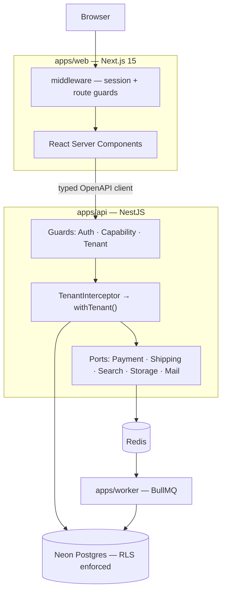

# Hossain Commerce

**A universal multi-tenant marketplace — the Daraz / Amazon shape.**
Any verified seller lists anything. Buyers search across all of them, compare competing offers on one product page, fill a single cart spanning many sellers, and check out once.

`TypeScript` · `NestJS` · `Neon Postgres` · `Next.js 15` · `Drizzle` · `Turborepo`

---

## ⚠️ Status: pre-implementation

**There is no application code in this repository yet.** What exists today is an audit of the system being replaced and an approved product spec. Phase 0 has not started.

This section is the first thing you should read and it will be kept accurate. A README that overstates what is built is the specific failure this project is a reaction to — see [`OVERVIEW.md`](./OVERVIEW.md), where all three of the previous READMEs described software that did not exist.

| | Document | What it is |
|---|---|---|
| 📋 | **[`docs/PRD-marketplace-migration.md`](./docs/PRD-marketplace-migration.md)** | The product spec — architecture, data model, features by role, 13-phase roadmap |
| 🔍 | **[`OVERVIEW.md`](./OVERVIEW.md)** | Audit of the legacy system, and why it is being replaced rather than repaired |

---

## What this is

A portfolio project built to demonstrate the parts of e-commerce that are genuinely hard. Most marketplace portfolios are a product grid with a Stripe button. The interesting problems all live after "Add to cart":

- **Tenant isolation** that holds under concurrency — Postgres RLS, not a `WHERE` clause someone might forget
- **A cart spanning many sellers** that fans out into independently fulfilled, refunded, and settled orders
- **A double-entry ledger** as the source of truth for money, so partial refunds and cash-on-delivery are ordinary cases rather than special ones
- **Real logistics** — multi-warehouse allocation, delivery zones, rate cards, slots, COD reconciliation, reverse pickups
- **A buy box** that ranks competing sellers on one product page

It may later be sold as a codebase, which is why every external integration sits behind a port with a mock adapter. A buyer in Bangladesh drops in SSLCommerz and Pathao; a buyer in the US drops in Stripe and Shippo. Neither touches order logic.

**Not in scope:** live payment rails, real KYC, prescription medicine or any regulated-health flow, native apps. See PRD §4.2.

---

## Architecture



The browser never calls the API directly. Every request originates server-side from a React Server Component or Server Action, so the access token lives in an `httpOnly` cookie and never reaches JavaScript.

### Key decisions

| Decision | Why |
|---|---|
| **Drizzle over Prisma** | RLS needs per-request session variables set inside a transaction; Prisma handles that awkwardly under connection pooling |
| **Postgres RLS for tenancy** | A forgotten `WHERE tenant_id` becomes a non-event instead of a data breach |
| **REST + OpenAPI over tRPC** | tRPC couples the tiers and hurts resale; generated clients give type safety *and* a language-agnostic contract |
| **Postgres FTS over Typesense** | One-command spin-up matters more than the ceiling. A `SearchProvider` port documents the upgrade path. |
| **Integer minor units for money** | The legacy server does `parseInt(price * 100)`. Floats never touch pricing, tax, or the ledger. |
| **Ledger from the first order** | Retrofitting double-entry onto existing orders is the most expensive mistake available here |

Full rationale in PRD §7.3. Architecture Decision Records land in `docs/architecture/` as each is made.

---

## Roadmap

13 phases, each independently deployable and demoable. Stop at any phase and there is still a coherent product.

| | Phase | Scope |
|---|---|---|
| ☐ | **0 · Foundation** | Monorepo, Neon, Drizzle, CI, Docker, seed harness, Mongo ETL |
| ☐ | **1 · Tenancy & Identity** | Orgs, membership, RBAC, **RLS + `withTenant`**, auth, seller onboarding |
| ☐ | **2 · Catalogue** | Categories, products, variants, **listings**, inventory, buy box |
| ☐ | **3 · Discovery** | FTS, facets, autocomplete, browse, recommendations |
| ☐ | **4 · Cart, Checkout & Ledger** | Multi-seller cart, pricing engine, `PaymentProvider` port, **double-entry ledger** |
| ☐ | **5 · Orders & Fulfilment** | Order state machine, per-seller queues, shipments, tracking |
| ☐ | **6 · Logistics & Delivery** | Warehouses, zones, rate cards, slots, **COD reconciliation**, reverse pickup |
| ☐ | **7 · Trust** | Verified reviews, Q&A, seller ratings, moderation |
| ☐ | **8 · Post-purchase** | RMA, refunds against the ledger, disputes |
| ☐ | **9 · Engagement** | Promotions, wishlists, loyalty, notifications, flash sales |
| ☐ | **10 · Seller tooling** | Bulk import, analytics, payout statements, ad campaigns |
| ☐ | **11 · Admin & Ops** | Moderation queues, audit log, impersonation, feature flags, CMS |
| ☐ | **12 · Platform quality** | i18n, observability, performance, accessibility, hardening |

Each phase has acceptance criteria in PRD §11 and gets its own spec → plan → implement cycle. A phase is not checked off here until its criteria pass in CI.

---

## Repository layout

### Today

```
.
├── README.md                       ← you are here
├── OVERVIEW.md                     audit of the legacy system
├── docs/
│   └── PRD-marketplace-migration.md
├── frontend/                       partial Next.js rewrite — see note below
└── old-code/                       legacy React 18 SPA + Express monolith
    ├── client-side/
    └── server-side/
```

### Target (from Phase 0)

```
.
├── apps/
│   ├── api/          NestJS — REST + OpenAPI
│   ├── web/          Next.js 15 App Router
│   └── worker/       BullMQ consumers
├── packages/
│   ├── db/           Drizzle schema · migrations · RLS · seed
│   ├── shared/       Zod schemas · domain types · pricing · money
│   ├── api-client/   generated from OpenAPI
│   └── config/       eslint · tsconfig · tailwind presets
├── scripts/mongo-etl/
├── docs/
└── archive/          ← old-code/ and frontend/ move here
```

> **On `frontend/`** — a partial Next.js 15 rewrite exists from an earlier attempt (~15k LOC). It does not build: two pages resolve to `/`, and its homepage runs on 990 lines of mock data. It is **not** the basis for `apps/web`. Its 33 shadcn/ui primitives and Tailwind theme are worth salvaging into `packages/config` and `apps/web`; the rest is archived. Details in [`OVERVIEW.md`](./OVERVIEW.md) §5.

---

## Getting started

**Nothing to run yet.** From Phase 0, this becomes:

```bash
pnpm install
pnpm db:push          # push Drizzle schema to a Neon branch
pnpm seed             # 8 seller orgs, 500 products, 200 orders, 300 reviews
pnpm dev              # api + web + worker
```

Target is a working local environment in under 10 minutes on a clean machine — tracked as success criterion S4 in the PRD. Seed data runs through the real API rather than direct inserts, so it exercises the same code paths a user would.

---

## The legacy system

`old-code/` holds the original: a React 18 + Vite SPA and a 685-line single-file Express server on MongoDB. It was a single-vendor pharmacy shop. A deployment of the old client may still be reachable at `hossain-pharma.netlify.app`; it is the legacy application and does not reflect this project.

The audit found it unsafe to deploy rather than merely dated. The headline: `POST /jwt` signs a token for any email in the request body with no verification, so every authorization check in the system is bypassable by anyone who knows an admin's email address. Seven further endpoints have no authentication at all, including `DELETE /products/:id` and a `GET /payments` that returns every customer's email and transaction history.

Full findings in [`OVERVIEW.md`](./OVERVIEW.md). Each is mapped to its target-state fix in PRD §2.

---

## A note on the name

This repository is named `hossain-pharma` and its history begins as a pharmacy project. The product is now a **universal marketplace** — pharmacy is not a vertical here, and prescription medicine is explicitly out of scope.

Renaming to **`hossain-commerce`** is planned alongside Phase 0:

```bash
# GitHub: Settings → Repository name → hossain-commerce
# GitHub redirects the old URL, so existing clones keep working.
git remote set-url origin https://github.com/iamshihab2020/hossain-commerce.git
```

Until that happens, the mismatch between the repo name and the product is deliberate and noted here rather than left for a reader to trip over.

---

## Contributing

Solo project, but the working agreement is written down because it is the point:

- Every phase gets a spec before code, and a plan before implementation
- Acceptance criteria are CI-enforced, not aspirational
- Test coverage: ≥ 80% on domain logic, **100% on pricing, ledger, and RLS** — the three places a bug is silent and expensive
- If a phase ships without meeting its criteria, the PRD is wrong and gets updated rather than quietly ignored

---

## Licence

Not yet licensed. All rights reserved pending a decision on resale.
