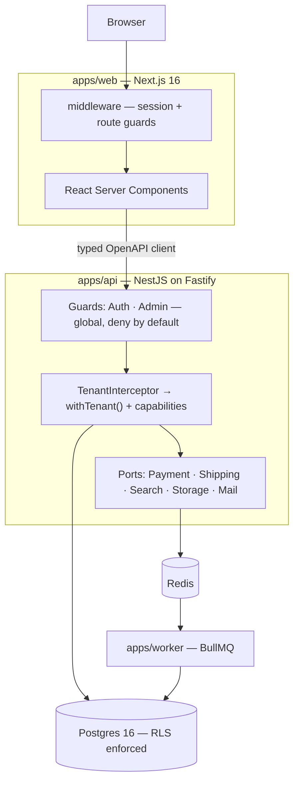

# NexMarket

**A universal multi-tenant marketplace — the Daraz / Amazon shape.**
Any verified seller lists anything. Buyers search across all of them, compare competing offers on one product page, fill a single cart spanning many sellers, and check out once.

`TypeScript` · `NestJS 11` · `Postgres 16` · `Next.js 16` · `Drizzle` · `Turborepo`

---

## Status: Phases 0-6 complete, Phase 7 not started

**What runs today:** a monorepo, a database with tenant isolation proven under concurrent load at both the query layer and over HTTP, an idempotent seed, and three applications that build and start — plus the whole of identity and tenancy. Registration and login (argon2id), refresh-token rotation with reuse detection, Google OAuth, a capability matrix, a globally-registered auth guard and tenant interceptor, seller onboarding with document upload, and a cursor-paginated admin approval queue.

Phase 2 added the catalogue: a three-level category tree, shared **products** with variants and per-category attributes, tenant-owned **listings**, per-warehouse inventory, seller listing CRUD, admin product moderation, and the **buy box** — two sellers on one product page, ranked on landed price.

Phase 3 added discovery: a materialised search index, weighted full-text search with `pg_trgm` typo tolerance, faceted filtering whose counts match the filtered results exactly, per-category dynamic facets, autocomplete, similar products, recently viewed and saved searches.

Phase 4 added commerce: a server-authoritative cart spanning many sellers with a guest cart that merges on login, an address book, a quote pipeline behind a `ShippingQuoteProvider` port, an age gate for restricted categories, a `PaymentProvider` port with **mock and cash-on-delivery** adapters, and a **double-entry ledger** whose balance invariant is enforced three times over.

Phase 5 added fulfilment: an order state machine whose status is COMPUTED from line coverage rather than set, seller accept/reject, **partial shipments** with carrier and tracking, per-parcel release of the seller's payable, buyer and seller cancellation with a ledger reversal, an append-only **order event log** behind the buyer's timeline, and printable packing slips and invoices. A seller's money now moves on **dispatch** rather than at capture, allocated per unit so two parcels sum exactly to what one capture would have paid.

Phase 6 added logistics: **delivery zones and pincode serviceability** (real Bangladeshi
postcodes, and the gaps are deliberate so "no courier covers 5820 yet" is a branch you can
see), **weight and dimensional rate cards** with chargeable weight as `max(actual,
volumetric)`, **delivery slots** with capacity a second booking cannot oversell,
**multi-warehouse allocation** that splits one order into two parcels from two buildings, a
`ShippingProvider` port with a time-compressed mock carrier whose webhook walks a parcel
through a full tracking timeline, **COD collection and reconciliation** clearing the
`cod_receivable` account Phase 4 opened and never closed, and return-pickup scheduling.

Three real bugs surfaced while building it, each fixed and each written down. Stock
reservation required a SINGLE warehouse row to hold the whole quantity, so a seller with
three units in Dhaka and three in Chattogram could not sell four while the catalogue
advertised six. `inventory_items.reserved` recorded that units were spoken for but never by
whom, so dispatching one order could consume another's reservation. And a **cash-on-delivery
order could never be fulfilled at all** — it stayed `PENDING_PAYMENT` until the cash was
collected, collection happens at the door, and the parcel only reaches the door if somebody
ships it.

**What does not exist yet:** reviews, returns, promotions. Those are Phases 7 through 9.
`packages/api-client` is still hand-written rather than generated from OpenAPI — it is a
shared contract of path plus schema that both the storefront and the API's own e2e suite
import, so a shape change is a type error in one place, but generating it has not fitted
into a phase yet.

This section is kept accurate deliberately. A README that overstates what is built is the specific failure this project is a reaction to — see [`OVERVIEW.md`](./OVERVIEW.md), where all three of the previous READMEs described software that did not exist.

| | Document | What it is |
|---|---|---|
| 📋 | **[`docs/PRD-marketplace-migration.md`](./docs/PRD-marketplace-migration.md)** | The product spec — architecture, data model, features by role, 13-phase roadmap |
| 🗺️ | **[`docs/SYSTEM-DESIGN.md`](./docs/SYSTEM-DESIGN.md)** | The system as built — 15 diagrams covering the request pipeline, tenancy, the data model, the lifecycles, the buy box and search |
| 🧭 | **[`docs/architecture/`](./docs/architecture/README.md)** | Decision records. **Start with 0003** |
| 🔍 | **[`OVERVIEW.md`](./OVERVIEW.md)** | Audit of the legacy system, and why it is being replaced rather than repaired |

---

## Getting started

Requires Node ≥ 22, pnpm ≥ 10, and Docker.

```bash
cp .env.example .env
pnpm install
docker compose up -d      # Postgres on 5433, Redis on 6380
pnpm db:push              # migrations, including RLS policies and grants
pnpm seed                 # 12 seller orgs, 5 users, 11 categories, 12 products, 26 listings
pnpm dev                  # api :4000 · web :3000 · worker
```

Then:

- <http://localhost:3000> — the web app
- <http://localhost:4000/health> — `{"status":"ok","database":"ok"}`
- <http://localhost:4000/docs> — Swagger UI, and every registered route appears in it (asserted by a test)

Seeded demo accounts all use the password `nexmarket-demo`: `admin@nexmarket.test`
(platform admin), `karim@acme.test` (OWNER of two organisations and STAFF in a third),
`nadia@acme.test`, `tanvir@acme.test`, and `rina@buyer.test` (a buyer, member of nothing).

**Ports are 5433 and 6380, not the defaults**, so this runs alongside other projects that already bind 5432/6379. See [ADR 0004](./docs/architecture/0004-local-docker-vs-neon.md).

`pnpm seed` is idempotent — running it twice is safe and is asserted in CI.

### Running the checks

```bash
pnpm lint && pnpm type-check && pnpm test && pnpm build
```

**381 tests** — api 180 · db 95 · shared 84 · mongo-etl 19 · worker 3 — plus a **4-test search benchmark** run separately by `pnpm --filter @nexmarket/api perf`, because a benchmark sharing a database with a parallel functional suite measures the contention rather than the query. The suite needs Docker but no database configuration: every suite that touches a database starts its own via Testcontainers. Verified by running it with `DATABASE_URL`, `DATABASE_MIGRATION_URL` and `REDIS_URL` all unset.

---

## What this is

A portfolio project built to demonstrate the parts of e-commerce that are genuinely hard. Most marketplace portfolios are a product grid with a Stripe button. The interesting problems all live after "Add to cart":

- **Tenant isolation** that holds under concurrency — Postgres RLS, not a `WHERE` clause someone might forget
- **A cart spanning many sellers** that fans out into independently fulfilled, refunded, and settled orders
- **A double-entry ledger** as the source of truth for money, so partial refunds and cash-on-delivery are ordinary cases rather than special ones
- **Real logistics** — multi-warehouse allocation, delivery zones, rate cards, slots, COD reconciliation, reverse pickups
- **A buy box** that ranks competing sellers on one product page

It may later be sold as a codebase, which is why every external integration sits behind a port with a mock adapter. A buyer in Bangladesh drops in SSLCommerz and Pathao; a buyer in the US drops in Stripe and Shippo. Neither touches order logic.

**Not in scope:** live payment rails, real KYC, prescription medicine or any regulated-health flow, native apps. See PRD §4.2.

---

## Tenant isolation

The architectural core, and the thing most likely to be got wrong silently. Full detail in [ADR 0003](./docs/architecture/0003-rls-app-role-and-pooling.md).

Three separate mistakes each reduce row-level security to decoration:

1. **Session-level `SET` instead of `SET LOCAL`.** The value persists on the pooled connection and the next request — possibly another tenant — inherits it. Invisible until concurrent load.
2. **`ENABLE` without `FORCE ROW LEVEL SECURITY`.** The table owner bypasses every policy, and migrations own the tables.
3. **Connecting as a role with `BYPASSRLS`.** It ignores all policies regardless. Neon hands you exactly such a role by default.

All three are closed, and the closure is tested rather than asserted:

| Check | Where |
|---|---|
| Connecting role has `rolsuper=f, rolbypassrls=f` | first test in the suite, and again in CI |
| Missing tenant context returns **zero** rows, never all rows | `tenant-context.test.ts`, `membership-rls.test.ts` |
| 40 interleaved requests, two tenants, one 5-connection pool, zero cross-reads | `tenant-context.test.ts` |
| 40 interleaved **HTTP** requests, two tenants, through the guard, the interceptor and the pool | `tenancy.e2e.test.ts` — ten consecutive runs, no flake |
| Context does not survive its transaction on a reused connection | `max:1` pool, asserted directly |
| Cross-tenant write refused with SQLSTATE `42501`, leaving no trace | `tenant-context.test.ts`, `membership-rls.test.ts` |
| `relforcerowsecurity` true on every tenant-owned table, false on the platform-owned ones | `membership-rls.test.ts`, read from `pg_class` |
| No route is both non-public and reachable without a token | `route-coverage.e2e.test.ts` — reflection over the router, not a hand-kept list |
| Every registered route appears in the OpenAPI document | `route-coverage.e2e.test.ts` |
| `_journal.json` lists exactly the migration files on disk | `migrations.test.ts` — Drizzle silently ignores unlisted ones |
| One seller's tenant-scoped read is not widened by the public offers policy | `catalogue-rls.test.ts` — the trap that ORed permissive policies set twice |
| Seller A cannot read or edit seller B's listing, and B's row is unchanged after the attempt | `listings.e2e.test.ts` |
| A cart spanning 3 sellers produces 3 orders under one payment | `checkout.e2e.test.ts` |
| A tampered total leaves **zero orders and zero ledger entries**, not merely an error | `checkout.e2e.test.ts` |
| The intent is still `REQUIRES_PAYMENT` after a successful confirm — only the webhook settles it | `checkout.e2e.test.ts` |
| The same webhook delivered twice captures once | `checkout.e2e.test.ts` — counted, not assumed |
| Exactly one of two concurrent checkouts takes the last unit | `checkout.e2e.test.ts` |
| An unbalanced ledger write fails at **COMMIT**, and `UPDATE`/`DELETE` are refused outright | `ledger-constraints.test.ts` |
| `cart_items` has no money column at all | `cart.e2e.test.ts` — asserted against the schema, not the response |
| The search index agrees with the view it is built from, after every write path | `search.e2e.test.ts` — the check that makes the reindex hooks verifiable |
| Facet counts equal what filtering by them returns, for every value of every facet | `search.e2e.test.ts` — asserted in a loop, not spot-checked |
| One user cannot read or delete another's saved searches | `search.e2e.test.ts` — there is no policy behind that table, so the filter is the boundary |
| Raw `db`/`pool` import banned outside `packages/db` | eslint, seen to fail against a violating file and then reverted |

100% coverage — statements, branches, functions and lines — on `tenant-context.ts`, `assert-driver.ts`, `money.ts`, `capabilities.ts` and `buy-box.ts`.

---

## Architecture

The diagram below is the shape. [`docs/SYSTEM-DESIGN.md`](./docs/SYSTEM-DESIGN.md)
is the full design: the request pipeline as a sequence, how a new table is
classified tenant- or platform-owned, the ERD, both state machines, the buy-box
ranking, the search write and query paths, and a table of every invariant with
the test that proves it.



The browser never calls the API directly. Every request originates server-side from a React Server Component or Server Action, so the access token lives in an `httpOnly` cookie and never reaches JavaScript.

The guards and the interceptor are built and globally registered as of Phase 1. `FileStorage` is the first port, with a local-filesystem adapter; the payment, shipping, search and mail ports arrive with the phases that need them.

---

## Repository layout

```
.
├── apps/
│   ├── api/          NestJS — REST + OpenAPI      (src/modules · src/common · src/config)
│   ├── web/          Next.js 16 App Router
│   └── worker/       BullMQ consumers
├── packages/
│   ├── db/           Drizzle schema · migrations · RLS · seed · withTenant
│   ├── shared/       Money and domain primitives
│   └── config/       eslint · tsconfig · tailwind preset
├── scripts/mongo-etl/  legacy MongoDB importer
├── docker/           Postgres init: the non-bypassrls app role
├── docs/
│   ├── PRD-marketplace-migration.md
│   ├── architecture/   ADRs
│   ├── runbook/        Neon setup
│   └── superpowers/plans/
└── archive/          the legacy SPA, Express monolith, and abandoned rewrite
```

Each app and package carries its own README describing its layout and conventions.

`packages/api-client` (generated from OpenAPI) is still not built. Phase 1 produced the API surface worth generating from; the generator did not fit into it, and saying so is better than listing it as done.

---

## Roadmap

13 phases, each independently deployable and demoable. Stop at any phase and there is still a coherent product.

| | Phase | Scope |
|---|---|---|
| ☑ | **0 · Foundation** | Monorepo, Postgres, Drizzle, CI, Docker, seed harness, Mongo ETL |
| ☑ | **1 · Tenancy & Identity** | Orgs, membership, RBAC, **RLS interceptor**, auth, seller onboarding |
| ☑ | **2 · Catalogue** | Categories, products, variants, **listings**, inventory, buy box |
| ☑ | **3 · Discovery** | FTS, facets, autocomplete, browse, recommendations |
| ☑ | **4 · Cart, Checkout & Ledger** | Multi-seller cart, pricing engine, `PaymentProvider` port, **double-entry ledger** |
| ☐ | **5 · Orders & Fulfilment** | Order state machine, per-seller queues, shipments, tracking |
| ☐ | **6 · Logistics & Delivery** | Warehouses, zones, rate cards, slots, **COD reconciliation**, reverse pickup |
| ☐ | **7 · Trust** | Verified reviews, Q&A, seller ratings, moderation |
| ☐ | **8 · Post-purchase** | RMA, refunds against the ledger, disputes |
| ☐ | **9 · Engagement** | Promotions, wishlists, loyalty, notifications, flash sales |
| ☐ | **10 · Seller tooling** | Bulk import, analytics, payout statements, ad campaigns |
| ☐ | **11 · Admin & Ops** | Moderation queues, audit log, impersonation, feature flags, CMS |
| ☐ | **12 · Platform quality** | i18n, observability, performance, accessibility, hardening |

Each phase has acceptance criteria in PRD §11 and gets its own spec → plan → implement cycle. **A phase is not ticked here until its criteria pass in CI.**

Phase 0 deferred two things deliberately. The `TenantInterceptor` (PRD §6.4 criterion 1) is now built and globally registered — that was Phase 1's headline deliverable. The ETL's load stage still cannot insert into tables Phase 4 has not created.

Phase 4 leaves **one PRD item deliberately unbuilt**: the PRD names three payment adapters and two ship — `mock` and cash on delivery. A Stripe adapter built against an account that does not exist is code no test can exercise and a README claim nobody can check, which is the specific failure this repository reacts to. The port is the seam; adding it is one class and one line. Recorded in [ADR 0018](./docs/architecture/0018-payment-port-and-webhook-idempotency.md) as a deviation, not as done. Also deliberately thin, with the phase that owns them named: shipping was a flat rate and tax one rate per country, and cash on delivery accrued to `COD_RECEIVABLE` and was never collected. **Phase 6 closed both shipping and COD**; tax is still one rate per country.

Phase 3 leaves one criterion **open, not done**: PRD §11 asks for **p95 < 300 ms on 50k products**, and this repository does not prove that number. Every query shape's median at 50k documents is 7–120 ms and its best case 4–108 ms, but the harness — a Docker-hosted Postgres sharing a machine with the rest of the suite — delivers 400–1100 ms stalls to queries whose best case is single-digit milliseconds. The perf suite therefore asserts the best case per shape, separately asserts the GIN indexes are used, and reports the full distribution on every run. The strict p95 needs a staging environment with dedicated hardware. Also absent, and for stated reasons: **"frequently bought together"** and a **best-selling sort** need order history (Phase 4), and **saved-search alerts** need notifications (Phase 9) — the searches are saved, nothing emails anyone.

Phase 2 leaves four things stated rather than hidden. **Landed price is flat, not zone-aware**, and it stays that way even after Phase 6: the buy box ranks for a visitor who has not said where they are, so it has no address to quote against. The response carries `basis: "flat-shipping"` so nothing downstream can assume otherwise, and the product page's own delivery check is where a real zone rate appears. **Seller rating is the second ranking key and is inert**, because there are no reviews until Phase 7; it is implemented and tested with synthetic values. **Bulk CSV import, tiered pricing and batch/lot expiry** are PRD §9.2 catalogue items deliberately deferred to Phase 10 or to Phase 6 warehousing. **`reserved` stock is written but never decremented** — reservation happens at checkout, in Phase 4; the column exists so `available = on_hand - reserved` is defined from the start rather than retrofitted.

Phase 1 leaves three things stated rather than hidden. **"A suspended seller can still fulfil open orders" is proven as a mechanism, not an outcome** — there are no orders until Phase 4, and the test name says so. **Document upload is mock KYC**, on a local-filesystem adapter behind a `FileStorage` port; PRD §4.2 lists real KYC as a non-goal. **Rate limiting is not implemented** — it belongs with the reverse proxy and Redis, and applying it to the auth routes alone would be half a solution.

---

## Key decisions

| Decision | Why |
|---|---|
| **Drizzle over Prisma** | RLS needs per-request session variables set inside a transaction; Prisma handles that awkwardly under pooling — [0002](./docs/architecture/0002-drizzle-over-prisma.md) |
| **Postgres RLS for tenancy** | A forgotten `WHERE tenant_id` becomes a non-event instead of a data breach — [0003](./docs/architecture/0003-rls-app-role-and-pooling.md) |
| **node-postgres over Neon HTTP** | The HTTP driver cannot hold interactive transactions, which RLS context and the ledger both need — [0005](./docs/architecture/0005-esm-and-the-driver-constraint.md) |
| **Integer minor units for money** | The legacy server does `parseInt(price * 100)`, which truncates. Floats never touch pricing, tax, or the ledger. |
| **REST + OpenAPI over tRPC** | tRPC couples the tiers and hurts resale; generated clients give type safety *and* a language-agnostic contract |
| **Postgres FTS over Typesense** | One-command spin-up matters more than the ceiling. A `SearchProvider` port documents the upgrade path. |
| **Ledger from the first order** | Retrofitting double-entry onto existing orders is the most expensive mistake available here |
| **`ts_rank`, not `ts_rank_cd`** | Cover density costs 1294 ms against 50k documents where `ts_rank` costs 246 ms, and rewards term proximity that barely exists in a four-word product name — [0015](./docs/architecture/0015-search-materialisation-and-ranking.md) |
| **Ledger entries are signed, debit positive** | So the balance rule is literally `SUM(amount) = 0`; a `direction` enum turns every check into a `CASE`, and every place that forgets it produces a wrong number that still looks like a number — [0016](./docs/architecture/0016-the-ledger-and-its-constraint-trigger.md) |
| **The ledger is platform-owned** | One capture posts against two sellers **and** the platform in one transaction, which no tenant GUC can express. It is the platform's books, not a seller's data — [0016](./docs/architecture/0016-the-ledger-and-its-constraint-trigger.md) |
| **The webhook is the only writer of payment status** | The port types `initialStatus` so no adapter *can* return a settled status; the rule is a type error rather than a code review — [0018](./docs/architecture/0018-payment-port-and-webhook-idempotency.md) |
| **Products shared, listings tenant-owned** | The legacy schema had `products.email` — one row per seller — which makes cross-seller comparison impossible and leaves no buy box to build — [0014](./docs/architecture/0014-products-listings-and-the-buy-box.md) |
| **Capabilities, never role names** | `@RequireCapability('member:write')` survives adding a sub-role; `role === 'OWNER'` does not — [0013](./docs/architecture/0013-capability-matrix-as-data.md) |
| **Refresh tokens as families** | One row per token cannot express reuse detection: once the old hash is overwritten, a stolen token and an unknown one are indistinguishable — [0012](./docs/architecture/0012-refresh-token-families.md) |
| **Google OAuth without Passport** | `@nestjs/passport` hands passport a `FastifyReply`, which lacks the redirect API it writes with — [0008](./docs/architecture/0008-google-oauth-without-passport.md) |

---

## The legacy system

`archive/` holds the original: a React 18 + Vite SPA and a 685-line single-file Express server on MongoDB, plus an abandoned Next.js 15 rewrite that never built.

The audit found the original **unsafe to deploy rather than merely dated**. `POST /jwt` signs a token for any email in the request body with no verification, so every authorization check is bypassable by anyone who knows an admin's email address. Seven further endpoints have no authentication at all, including `DELETE /products/:id` and a `GET /payments` that returns every customer's email and transaction history.

Full findings in [`OVERVIEW.md`](./OVERVIEW.md). Each is mapped to its target-state fix in PRD §2.

---

## A note on the repository name

This repository is still named `hossain-pharma` and its history begins as a pharmacy project. The product is now a **universal marketplace** — pharmacy is not a vertical here, and prescription medicine is explicitly out of scope.

```bash
# GitHub: Settings → Repository name → nexmarket
# GitHub redirects the old URL, so existing clones keep working.
git remote set-url origin https://github.com/iamshihab2020/nexmarket.git
```

Until that happens the mismatch is deliberate and noted here rather than left for a reader to trip over. Names inside `archive/` are left alone on purpose: renaming them would falsify the record of what the legacy system actually was.

---

## Working agreement

Solo project, but written down because it is the point:

- Every phase gets a spec before code, and a plan before implementation
- Acceptance criteria are CI-enforced, not aspirational
- Test coverage: ≥ 80% on domain logic, **100% on pricing, ledger, and RLS** — the three places a bug is silent and expensive
- If a phase ships without meeting its criteria, the PRD is wrong and gets updated rather than quietly ignored

---

## Licence

Not yet licensed. All rights reserved pending a decision on resale.
