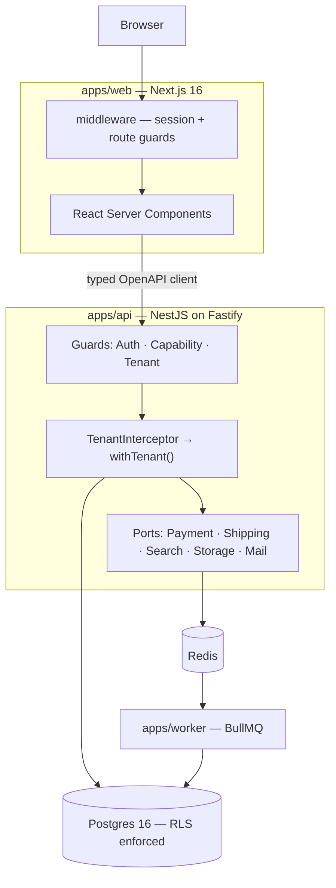

# NexMarket

**A universal multi-tenant marketplace — the Daraz / Amazon shape.**
Any verified seller lists anything. Buyers search across all of them, compare competing offers on one product page, fill a single cart spanning many sellers, and check out once.

`TypeScript` · `NestJS 11` · `Postgres 16` · `Next.js 16` · `Drizzle` · `Turborepo`

---

## Status: Phase 0 complete, Phase 1 not started

**What runs today** is the foundation: a monorepo, a database with tenant isolation proven under concurrent load, an idempotent seed, and three applications that build and start.

**What does not exist yet:** authentication, users, sellers beyond eight seed rows, catalogue, search, cart, orders, ledger, logistics. Those are Phases 1 through 6.

This section is kept accurate deliberately. A README that overstates what is built is the specific failure this project is a reaction to — see [`OVERVIEW.md`](./OVERVIEW.md), where all three of the previous READMEs described software that did not exist.

| | Document | What it is |
|---|---|---|
| 📋 | **[`docs/PRD-marketplace-migration.md`](./docs/PRD-marketplace-migration.md)** | The product spec — architecture, data model, features by role, 13-phase roadmap |
| 🧭 | **[`docs/architecture/`](./docs/architecture/README.md)** | Decision records. **Start with 0003** |
| 🔍 | **[`OVERVIEW.md`](./OVERVIEW.md)** | Audit of the legacy system, and why it is being replaced rather than repaired |

---

## Getting started

Requires Node ≥ 22, pnpm ≥ 10, and Docker.

```bash
cp .env.example .env
pnpm install
docker compose up -d      # Postgres on 5433, Redis on 6380
pnpm db:push              # migrations, including RLS policies and grants
pnpm seed                 # 5 countries, 5 currencies, 8 seller organisations
pnpm dev                  # api :4000 · web :3000 · worker
```

Then:

- <http://localhost:3000> — the web app
- <http://localhost:4000/health> — `{"status":"ok","database":"ok"}`
- <http://localhost:4000/docs> — Swagger UI

**Ports are 5433 and 6380, not the defaults**, so this runs alongside other projects that already bind 5432/6379. See [ADR 0004](./docs/architecture/0004-local-docker-vs-neon.md).

`pnpm seed` is idempotent — running it twice is safe and is asserted in CI.

### Running the checks

```bash
pnpm lint && pnpm type-check && pnpm test && pnpm build
```

**71 tests.** The suite needs Docker but no database configuration: every suite that touches a database starts its own via Testcontainers. Verified by running it with `DATABASE_URL`, `DATABASE_MIGRATION_URL` and `REDIS_URL` all unset.

---

## What this is

A portfolio project built to demonstrate the parts of e-commerce that are genuinely hard. Most marketplace portfolios are a product grid with a Stripe button. The interesting problems all live after "Add to cart":

- **Tenant isolation** that holds under concurrency — Postgres RLS, not a `WHERE` clause someone might forget
- **A cart spanning many sellers** that fans out into independently fulfilled, refunded, and settled orders
- **A double-entry ledger** as the source of truth for money, so partial refunds and cash-on-delivery are ordinary cases rather than special ones
- **Real logistics** — multi-warehouse allocation, delivery zones, rate cards, slots, COD reconciliation, reverse pickups
- **A buy box** that ranks competing sellers on one product page

It may later be sold as a codebase, which is why every external integration sits behind a port with a mock adapter. A buyer in Bangladesh drops in SSLCommerz and Pathao; a buyer in the US drops in Stripe and Shippo. Neither touches order logic.

**Not in scope:** live payment rails, real KYC, prescription medicine or any regulated-health flow, native apps. See PRD §4.2.

---

## Tenant isolation

The architectural core, and the thing most likely to be got wrong silently. Full detail in [ADR 0003](./docs/architecture/0003-rls-app-role-and-pooling.md).

Three separate mistakes each reduce row-level security to decoration:

1. **Session-level `SET` instead of `SET LOCAL`.** The value persists on the pooled connection and the next request — possibly another tenant — inherits it. Invisible until concurrent load.
2. **`ENABLE` without `FORCE ROW LEVEL SECURITY`.** The table owner bypasses every policy, and migrations own the tables.
3. **Connecting as a role with `BYPASSRLS`.** It ignores all policies regardless. Neon hands you exactly such a role by default.

All three are closed, and the closure is tested rather than asserted:

| Check | Where |
|---|---|
| Connecting role has `rolsuper=f, rolbypassrls=f` | first test in the suite, and again in CI |
| Missing tenant context returns **zero** rows, never all rows | `tenant-context.test.ts` |
| 40 interleaved requests, two tenants, one 5-connection pool, zero cross-reads | `tenant-context.test.ts` |
| Context does not survive its transaction on a reused connection | `max:1` pool, asserted directly |
| Cross-tenant write refused with SQLSTATE `42501`, leaving no trace | `tenant-context.test.ts` |
| Raw `db`/`pool` import banned outside `packages/db` | eslint, verified by running it against a violating file |

100% coverage on `tenant-context.ts`, `assert-driver.ts`, and `money.ts`.

---

## Architecture



The browser never calls the API directly. Every request originates server-side from a React Server Component or Server Action, so the access token lives in an `httpOnly` cookie and never reaches JavaScript.

Guards, the interceptor, and the ports are Phase 1 onward. Phase 0 built the layer underneath them.

---

## Repository layout

```
.
├── apps/
│   ├── api/          NestJS — REST + OpenAPI      (src/modules · src/common · src/config)
│   ├── web/          Next.js 16 App Router
│   └── worker/       BullMQ consumers
├── packages/
│   ├── db/           Drizzle schema · migrations · RLS · seed · withTenant
│   ├── shared/       Money and domain primitives
│   └── config/       eslint · tsconfig · tailwind preset
├── scripts/mongo-etl/  legacy MongoDB importer
├── docker/           Postgres init: the non-bypassrls app role
├── docs/
│   ├── PRD-marketplace-migration.md
│   ├── architecture/   ADRs
│   ├── runbook/        Neon setup
│   └── superpowers/plans/
└── archive/          the legacy SPA, Express monolith, and abandoned rewrite
```

Each app and package carries its own README describing its layout and conventions.

`packages/api-client` (generated from OpenAPI) arrives when there is an API surface worth generating from — Phase 1.

---

## Roadmap

13 phases, each independently deployable and demoable. Stop at any phase and there is still a coherent product.

| | Phase | Scope |
|---|---|---|
| ☑ | **0 · Foundation** | Monorepo, Postgres, Drizzle, CI, Docker, seed harness, Mongo ETL |
| ☐ | **1 · Tenancy & Identity** | Orgs, membership, RBAC, **RLS interceptor**, auth, seller onboarding |
| ☐ | **2 · Catalogue** | Categories, products, variants, **listings**, inventory, buy box |
| ☐ | **3 · Discovery** | FTS, facets, autocomplete, browse, recommendations |
| ☐ | **4 · Cart, Checkout & Ledger** | Multi-seller cart, pricing engine, `PaymentProvider` port, **double-entry ledger** |
| ☐ | **5 · Orders & Fulfilment** | Order state machine, per-seller queues, shipments, tracking |
| ☐ | **6 · Logistics & Delivery** | Warehouses, zones, rate cards, slots, **COD reconciliation**, reverse pickup |
| ☐ | **7 · Trust** | Verified reviews, Q&A, seller ratings, moderation |
| ☐ | **8 · Post-purchase** | RMA, refunds against the ledger, disputes |
| ☐ | **9 · Engagement** | Promotions, wishlists, loyalty, notifications, flash sales |
| ☐ | **10 · Seller tooling** | Bulk import, analytics, payout statements, ad campaigns |
| ☐ | **11 · Admin & Ops** | Moderation queues, audit log, impersonation, feature flags, CMS |
| ☐ | **12 · Platform quality** | i18n, observability, performance, accessibility, hardening |

Each phase has acceptance criteria in PRD §11 and gets its own spec → plan → implement cycle. **A phase is not ticked here until its criteria pass in CI.**

Phase 0 deferred two things deliberately, both recorded rather than quietly skipped: the `TenantInterceptor` (PRD §6.4 criterion 1) has no tenant-scoped route to wrap yet, and the ETL's load stage cannot insert into tables Phase 4 has not created.

---

## Key decisions

| Decision | Why |
|---|---|
| **Drizzle over Prisma** | RLS needs per-request session variables set inside a transaction; Prisma handles that awkwardly under pooling — [0002](./docs/architecture/0002-drizzle-over-prisma.md) |
| **Postgres RLS for tenancy** | A forgotten `WHERE tenant_id` becomes a non-event instead of a data breach — [0003](./docs/architecture/0003-rls-app-role-and-pooling.md) |
| **node-postgres over Neon HTTP** | The HTTP driver cannot hold interactive transactions, which RLS context and the ledger both need — [0005](./docs/architecture/0005-esm-and-the-driver-constraint.md) |
| **Integer minor units for money** | The legacy server does `parseInt(price * 100)`, which truncates. Floats never touch pricing, tax, or the ledger. |
| **REST + OpenAPI over tRPC** | tRPC couples the tiers and hurts resale; generated clients give type safety *and* a language-agnostic contract |
| **Postgres FTS over Typesense** | One-command spin-up matters more than the ceiling. A `SearchProvider` port documents the upgrade path. |
| **Ledger from the first order** | Retrofitting double-entry onto existing orders is the most expensive mistake available here |

---

## The legacy system

`archive/` holds the original: a React 18 + Vite SPA and a 685-line single-file Express server on MongoDB, plus an abandoned Next.js 15 rewrite that never built.

The audit found the original **unsafe to deploy rather than merely dated**. `POST /jwt` signs a token for any email in the request body with no verification, so every authorization check is bypassable by anyone who knows an admin's email address. Seven further endpoints have no authentication at all, including `DELETE /products/:id` and a `GET /payments` that returns every customer's email and transaction history.

Full findings in [`OVERVIEW.md`](./OVERVIEW.md). Each is mapped to its target-state fix in PRD §2.

---

## A note on the repository name

This repository is still named `hossain-pharma` and its history begins as a pharmacy project. The product is now a **universal marketplace** — pharmacy is not a vertical here, and prescription medicine is explicitly out of scope.

```bash
# GitHub: Settings → Repository name → nexmarket
# GitHub redirects the old URL, so existing clones keep working.
git remote set-url origin https://github.com/iamshihab2020/nexmarket.git
```

Until that happens the mismatch is deliberate and noted here rather than left for a reader to trip over. Names inside `archive/` are left alone on purpose: renaming them would falsify the record of what the legacy system actually was.

---

## Working agreement

Solo project, but written down because it is the point:

- Every phase gets a spec before code, and a plan before implementation
- Acceptance criteria are CI-enforced, not aspirational
- Test coverage: ≥ 80% on domain logic, **100% on pricing, ledger, and RLS** — the three places a bug is silent and expensive
- If a phase ships without meeting its criteria, the PRD is wrong and gets updated rather than quietly ignored

---

## Licence

Not yet licensed. All rights reserved pending a decision on resale.
