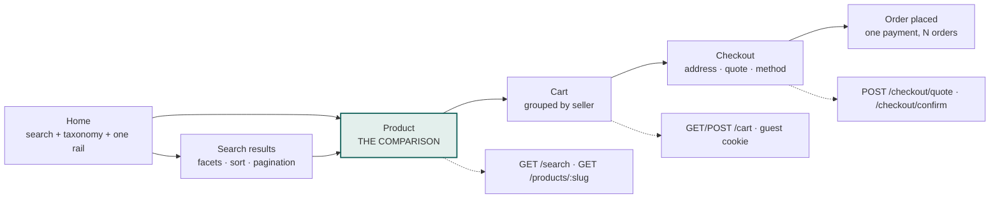

# Design direction — the buyer front end

**Status:** proposed, not yet built against.
**Date:** 2026-09-05
**Scope:** `apps/web`, the buyer path. The seller console is sketched here and
designed properly once Phase 5 settles the fulfilment states it displays.

`docs/SYSTEM-DESIGN.md` is the system as built. This is how it should look, and
why — every choice below is derived either from the market or from something the
backend already does.

---

## The thesis: show the competition

Amazon, Daraz, Alibaba and Shopee converge on one interface — a banner carousel,
a countdown, and a buy box that shows a single price without saying how it won.
It works, and it leaves an opening.

The opening is the thing this backend is unusually good at. `buy-box.ts` is a
pure, tested ranking function that ranks on **landed price**, and it carries
`BUY_BOX_BASIS` in the API response specifically so a client cannot present an
estimate as a quote. The catalogue is shared by competing sellers on purpose
(PRD 8.3). The ledger has to balance.

**The interface should say what the code says.** The comparison is the hero, not
a hidden widget.

Everything below follows from that sentence, and anything that does not serve it
is cut.

---

## 1. Who we are designing for

Four facts. Design decisions come from these, not from a mockup on a 27-inch
monitor.

| | |
|---|---|
| **The device** | A mid-range Android on 4G, held at arm's length, often on metered data. Sized and budgeted for that first; desktop is the adaptation, not the source. |
| **The money** | ৳ BDT, 15% VAT (`taxBpsFor('BD')` returns 1500), and **cash on delivery as a first-class method** rather than a fallback. Prices are the most-read element in the product. |
| **The language** | Bengali and English together, often in one sentence. The type system holds both scripts at a matched optical size from day one. |
| **The imagery** | Seller-uploaded photography: unedited, inconsistent, mostly white cut-outs of varying quality. The interface cannot add colour noise on top of that and stay readable. |

---

## 2. The position

| Decision | The category default | NexMarket |
|---|---|---|
| Brand colour | Orange, universally. And in Bangladesh, bKash owns magenta, Nagad orange, Rocket purple — the payment brands eat the rest of the obvious palette. | **Petrol green.** Unclaimed in this market, reads as verification rather than discount, holds up on both grounds. |
| The buy box | One winning price; other sellers behind a link nobody opens. | An open comparison. The winner is a row in it, and the page says why it won. |
| Urgency | Countdown timers, flash-sale rails, "3 people are viewing this". | **None.** A discount is arithmetic and is shown as arithmetic. |
| Home page | Carousel over icon grid over infinite rails. | Search as a typographic object, the taxonomy as a readable list, one rail with a reason to exist. |
| Colour in the UI | Decorative: tinted heroes, accent bars on cards, coloured section headers. | **Informational only.** If something is coloured, the colour means something. |

### The risk, stated plainly

Removing manufactured urgency from a market that runs on flash sales will cost
some conversion on impulse categories. The bet is that a marketplace which
visibly refuses to manipulate is worth more over a year than a countdown is worth
over a weekend — and that it is the one position the incumbents cannot copy
without contradicting themselves.

This is the single place the design spends boldness. Everything else is quiet.

---

## 3. The product page

The screen the whole system exists to produce, and the one place the design
should be memorable. Four columns, aligned so the eye can scan **down** a column
as well as across a row. Alignment does the work colour usually does.

The worked example that makes the point:

| Seller | Delivered | Sticker + delivery | Arrives | Payment |
|---|---:|---:|---:|---|
| **Bengal Tech** — *best delivered price* | **৳31,600** | ৳31,600 + free | Tomorrow | Cash or card |
| Dhaka Digital | ৳31,640 | ৳31,190 + ৳450 | In 5 days | Card only |
| Sky Electronics | ৳31,900 | ৳31,900 + free | In 2 days | Cash or card |
| Rangpur Mobile Hub — *2 left* | ৳32,490 | ৳32,400 + ৳90 | In 3 days | Cash or card |

**The cheapest sticker price loses.** Dhaka Digital lists ৳410 lower and still
comes second once ৳450 of delivery lands. Every other marketplace hides that.
Ours makes it the point of the table — and it is exactly what `landedPrice()`
already computes.

Four rules for this screen:

- **One badge, one meaning.** Petrol marks the winner. Amber marks a risk — low
  stock, a price that moved. Nothing else on the page is coloured, so both read
  instantly.
- **The honest footnote is part of the design.** "Ranked by delivered price.
  Delivery is each seller's flat rate until we quote your address at checkout."
  Delivery zones are Phase 6; `BUY_BOX_BASIS` exists so the page can say which
  basis it used, and the page must use it. An estimate presented as a quote is
  the thing buyers never forgive.
- **The sticky mobile bar names the seller.** On a marketplace, "Add to cart"
  without a seller name is a trap.
- **One animation in the whole product.** Choosing a different seller animates
  the total to its new value, so you see what changed. That is the entire motion
  budget. Motion answers an action or it does not appear.

---

## 4. Colour

Neutrals are shifted slightly green toward the accent rather than taken off the
shelf, so the greys belong to the palette instead of sitting beside it. Both
themes are designed sets — the dark palette is not the light one inverted.

| Token | Light | Dark | Use |
|---|---|---|---|
| `ground` | `#EFF1F0` | `#0A100F` | The page. Surfaces sit above it, so they need no shadow to separate. |
| `surface` | `#FFFFFF` | `#121A18` | Cards, tables, sheets. |
| `ink` | `#0D1F1C` | `#E7EEEC` | Text. The darkest tint of the brand, not black — black on a green-grey ground reads as a hole punched in the page. |
| `muted` | `#576663` | `#93A5A1` | Secondary text, sticker prices, metadata. AA at 14px on every surface it is used on - page, `card`, `sunk` and `wash` - which is now asserted by axe in the E2E journeys rather than claimed. It was `#5B6B68` until that scan measured it at 4.39:1 on `sunk`. |
| `signal` | `#0A5C55` | `#63C7B7` | Primary action, focus ring, buy-box winner. Nothing decorative. |
| `warn` | `#8A5200` | `#D7A25A` | Low stock, price changed, payment pending. The only warm colour, and **it never means "sale"**. |

**Colour is information.** There is no accent bar on a card, no tinted hero, no
coloured section header anywhere in this system. Saturation is spent only where
it tells the buyer something they would otherwise have to read for. That is what
lets a wall of unedited seller photography sit on the page without turning into
noise, and it is why removing sale-red costs nothing visually.

**Dark mode needs one extra rule:** seller photos are mostly white cut-outs and
glare on a dark ground. Product imagery takes a ~92% brightness filter in dark
mode. Without it the catalogue is unusable at night, which is when a lot of this
market shops.

Structure the CSS token-first: the bare `:root` block carries the complete light
palette, `@media (prefers-color-scheme: dark)` guarded as
`:root:not([data-theme="light"])` redefines the tokens, and
`:root[data-theme="dark"]` redefines them again so an explicit choice wins in
both directions. A colour defined only inside a media block does not apply in the
default un-stamped state, which is what most visitors get.

---

## 5. Type

**IBM Plex Sans** for everything, chosen for its tabular figures and its
engineered rather than friendly tone. Prices are the most-read element in the
product and money should look measured. No marketplace in this category uses it,
and it is not Inter.

**Anek Bangla** is the Bengali partner at a matched x-height. A second script,
not a second voice — display weight comes from size, weight and tracking, never
from a third family.

**IBM Plex Mono** appears only on machine identifiers a person may need to read
aloud or type: order numbers, SKUs, tracking codes. Never on labels. The
distinction matters — mono as a decorative label treatment is a tell; mono on an
order number is information encoding.

| Role | Size / leading | Weight | Notes |
|---|---|---|---|
| display | 40 / 44 | 700 | tracking −0.035em |
| h1 | 30 / 36 | 600 | |
| h2 | 22 / 29 | 600 | product titles |
| h3 | 17 / 24 | 600 | |
| body | 16 / 26 | 400 | 68ch measure or less |
| body · bn | 16 / 28 | 400 | Bengali carries more leading |
| ui | 15 / 22 | 400 | dense controls, table cells |
| price | 26 / 29 | 600 | `font-variant-numeric: tabular-nums` |
| small | 13 / 20 | 400 | `muted` |
| mono | 13 / 20 | 400 | identifiers only |

**The Bengali constraint is a budget line, not a nice-to-have.** An unsubsetted
Anek Bangla is several times the weight of the Latin face. Subset it to the
ranges actually used and serve it only on pages that render Bengali. On metered
4G this is a larger performance decision than any image on the page.

---

## 6. Layout and structure

Shell 1180px, 12 columns, **left-aligned throughout**. Nothing on a marketplace
is read; it is scanned. Text left, numbers right and tabular, centred type
nowhere.

**Radius is spent by role, not stamped everywhere:** 0 on table rows, 6px on
controls, 10px on product tiles. One elevation exists and is reserved for the
mobile buy bar and dialogs. Separation is otherwise carried by line and ground
contrast.

### Home

No carousel, no countdown, one rail. Search set as a typographic object with the
taxonomy immediately beneath it as a readable list rather than an icon grid.

The rail is **"Where sellers compete"** — products with the most offers today,
ranked on `search_documents.seller_count`, which the index already stores. It
costs nothing to build and it dramatises the thesis on the first screen.

### The buyer slice

---

## 7. Two surfaces, one system

The shop and the seller console share every token and diverge in density. The
console drops product-photography chrome, tightens to a tabular rhythm, and
trades tiles for rows — it is operated all day by someone who knows it, not
browsed once by someone who does not.

**One requirement comes from the architecture rather than from taste.** A seller
can belong to more than one organisation, and every request carries the
organisation it acts as (`x-tenant-id`). Acting in the wrong shop — repricing the
wrong listing, reading the wrong order queue — is a real and quiet hazard, so the
**current organisation is permanently visible in the top-left of the console and
is the first thing in the tab title.** Not a setting buried in a menu.

The buyer's account and the seller's console are the same person's session with
different capabilities, so moving between them is a link, never a second login.

---

## 8. Voice

Plain verbs, sentence case, no exclamation marks, no apologies. Errors say what
happened and what to do. A control names exactly what it does and keeps that name
through the whole flow.

| Moment | Not this | This |
|---|---|---|
| Price moved mid-checkout (409 `PRICE_CHANGED`) | Error 409: price validation failed. Please try again. | The price changed while you were checking out. The new total is ৳31,940 — review it before you pay. |
| Cash on delivery selected | COD available! | Pay ৳31,600 in cash when it arrives. |
| Cart is empty | Your cart is empty. | Nothing here yet. Search for something, or start with electronics. |
| Signing in with a guest cart | Cart merged successfully. | We kept the 3 items you added before signing in. |
| Cart spans three sellers | Your order has been split. | You pay once. Each seller ships separately, so items arrive on different days. |
| Seller suspended mid-cart | Item unavailable. | Bengal Tech has stopped selling. Three other sellers have this — the cheapest is ৳31,640 delivered. |

The last one is the pattern for every failure on this product: **name what
happened, then hand back the next move.** On a marketplace there is almost always
another seller, so an empty error is a lost order.

---

## 9. Budget

On a metered connection and a mid-range phone, performance is not a technical
concern that follows the design — it is a constraint that produces it.

- **LCP under 2.5s** on a throttled mid-tier Android over 4G. The LCP element is
  the product image, sized and prioritised explicitly.
- **Under 120 KB of JavaScript** on the product page. Server components render
  the comparison; only the seller selector and the cart are interactive.
- **No carousel library, no animation library, no icon font.** Icons are inline
  SVG and the handful we use are drawn once.
- **Zero layout shift on the price.** It is the element people look at, and a
  price that moves after paint is the one shift that costs trust.
- **AVIF with WebP fallback**, explicit dimensions, lazy below the fold. Seller
  uploads are normalised on the way in, never in the browser.
- **Usable at 320px and at 200% zoom**, with a visible keyboard focus ring in
  both themes.

---

## 10. Build order

One vertical slice, end to end, before any breadth. Going narrow first makes the
API shapes prove themselves against a real screen while they are still cheap to
change — 68 routes currently have zero consumers.

1. **Seed a demoable market.** Enough products, sellers and competing offers that
   the comparison has something to compare, plus one completed order. This was
   left undone in Phase 4 (plan Task 10, step 2) and now blocks everything below.
2. **Generate `packages/api-client` from OpenAPI.** `SwaggerModule` is already
   wired in `main.ts`. Hand-written fetch calls drift from the server silently
   and you find out in the browser; a generated client makes a shape change a
   build failure.
3. **Tokens, type, and four primitives** — price, seller line, offer row,
   quantity control. Everything after this is composition.
4. **The product page.** Built first because it is the thesis and the hardest
   screen. If the comparison does not work here the direction is wrong, and we
   find that out on day one rather than after the checkout is built.
5. **Search and category browsing.** Facets, sort, pagination. The index already
   returns what this needs.
6. **Cart, sign-in, and the guest merge.** The riskiest part of the slice: the
   guest cart lives in a cookie whose token is stored hashed, and a merge that
   silently drops items looks like nothing at all. Worth its own tests.
7. **Checkout, cash on delivery, confirmation.** Order confirmation now; order
   history stays deliberately thin until Phase 5 settles the fulfilment states it
   would display.

---

## 11. Open decisions

Four things this direction does not settle, all worth deciding before step 4.

- **A widest-spread rail would be stronger than "most offers".** "Sellers
  disagree most on price here" is the sharpest expression of the thesis. It needs
  a maximum-price column on `search_documents` — a small migration, and the view
  in migration 0010 is the one place it would be computed.
- **Bengali is designed for but not committed to.** Shipping English-only first
  is defensible; shipping a layout that cannot take Bengali later is not, which
  is why the type system carries it now and the font budget accounts for it.
- ~~**There is no front-end test convention yet**~~ — **settled in Phase 5.**
  Vitest in the NODE environment: no jsdom, no browser runner, no snapshots.
  What gets tested is the pure view helpers in `lib/` and the server actions'
  input parsing, because `apps/web` renders server components that a DOM testing
  library cannot meaningfully drive - so anything worth asserting is pushed into
  plain functions over plain values and the component keeps only markup. See
  `lib/order-timeline.test.ts`, which states the reasoning where the next person
  will look for it. Behaviour stays in the API's e2e suite, against a real
  server.
- **Seller ratings are null everywhere until Phase 7.** `buy-box.ts` documents
  this: the second ranking key is implemented, tested and currently inert. The
  comparison would show a rating column empty for months. Either it degrades by
  design or the column comes out until it has data — a column of dashes reads as
  a broken page.

---

## Related

- `docs/SYSTEM-DESIGN.md` — the system as built
- `packages/shared/src/buy-box.ts` — the ranking this page renders, and
  `BUY_BOX_BASIS`
- `packages/shared/src/pricing.ts` — VAT and commission, in basis points
- `docs/architecture/0017-orders-and-the-buyer-policy.md` — where
  `PRICE_CHANGED` comes from
- `docs/architecture/0018-payment-port-and-webhook-idempotency.md` — cash on
  delivery as a first-class method
