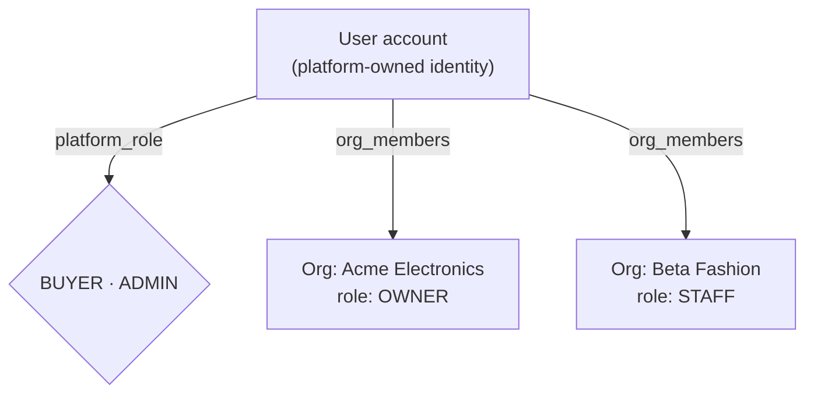
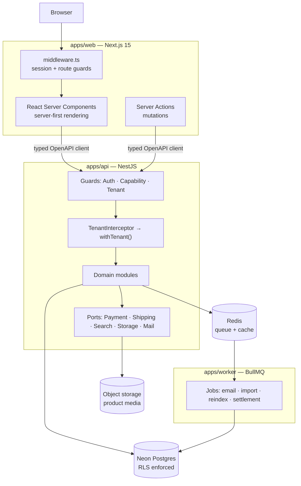
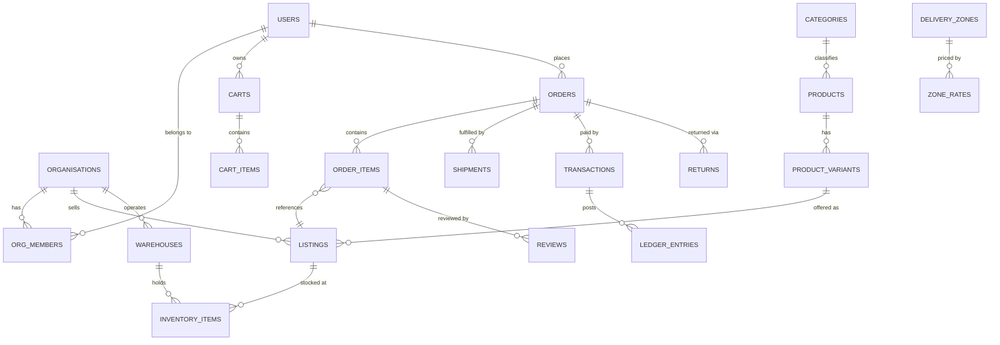
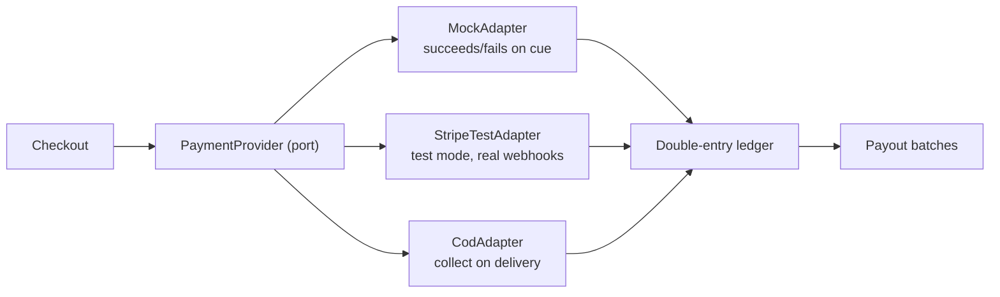

# Product Requirements Document
# NexMarket — Universal Multi-Tenant Marketplace

**Migration:** MongoDB + Express + React SPA → **NestJS + Neon Postgres + Next.js 15**

| | |
|---|---|
| **Version** | 2.0 |
| **Date** | 2026-08-23 |
| **Author** | Sheikh Shihab NexMarket |
| **Status** | Approved — ready for Phase 0 |
| **Supersedes** | `old-code/` (React 18 SPA + Express monolith) |
| **Companion** | [`OVERVIEW.md`](../OVERVIEW.md) — audit of the system being replaced |

> **v2.0 changed the product.** v1.0 positioned this as a pharmacy-first platform with a regulated vertical. That was wrong. This is a **universal marketplace** — the Daraz / Amazon shape, selling anything. All pharmacy-specific machinery (prescription flow, pharmacist role, licence verification) is removed. The phase it occupied now covers **Logistics & Delivery**.

---

## 1. TL;DR

Rebuild a small single-vendor shop into a **universal multi-tenant marketplace** — the Daraz / Amazon / Alibaba shape. Any verified seller lists anything; buyers search across all of them, fill one cart spanning many sellers, and check out once.

- **Tenant = seller organisation.** One storefront, many seller orgs, shared catalogue, one cart split across sellers, platform-owned buyer identity.
- **Isolation = Postgres Row-Level Security** on a shared schema, enforced per-request inside a transaction.
- **Three roles:** `BUYER` · `SELLER` (org-scoped, four sub-roles) · `ADMIN`.
- **13 phases**, each independently deployable and demoable.
- **Payments are simulated.** A `PaymentProvider` port with mock / Stripe-test / COD adapters over a real double-entry ledger. No live rails, no KYC, no merchant accounts.

### Project intent

This is a **portfolio project that may later be sold as a codebase**. That is a real constraint, not a footnote, and it shapes every decision below:

| Optimise for | De-prioritise |
|---|---|
| Breadth of visibly working features | Real vendor contracts, live KYC |
| Architecture legible to a code reviewer | Production scale tuning |
| One-command spin-up with rich seed data | Regulatory paperwork, PCI scope |
| Clean ports where a buyer plugs in *their* vendors | Multi-region, HA topology |
| Documentation where every claim is true | Cost optimisation |

**The recurring rule:** wherever a real integration would need a commercial contract, ship a **port + mock adapter + one working sandbox adapter**, and document the swap. A buyer in Bangladesh drops in SSLCommerz and Pathao; a buyer in the US drops in Stripe and Shippo. Neither touches order logic.

---

## 2. Why migrate

The audit in `OVERVIEW.md` found the current system is not merely dated — it is **not buildable and not safe to deploy**. Selected findings, each mapped to the target-state answer:

| Current defect | Target-state answer |
|---|---|
| `POST /jwt` mints a token for **any** email, unauthenticated — every authz check is bypassable | Self-hosted auth; tokens issued only after credential verification (Phase 1) |
| Frontend does not build — two pages resolve to `/` | Clean App Router layout; CI runs `build` + `type-check` from Phase 0 |
| 7 endpoints unauthenticated, incl. `DELETE /products/:id` and `GET /payments` (leaks all customer PII) | Deny-by-default route policy; guards + RLS |
| No route protection — a client `useEffect` reading `localStorage` | Server-side session checks in middleware + RSC |
| Client-supplied price to Stripe; no webhook; order written by the browser | Server-side repricing; ledger is source of truth; webhooks are the only status writer |
| No pagination anywhere; product detail fetches the whole catalogue | Cursor pagination mandatory, enforced by lint rule + tests |
| Roles mutually exclusive (`verifyAdmin` rejects sellers) | Membership join table; one human, many orgs, many roles |
| `DELETE /approvedAds/:id` deletes from the wrong collection | Single `ad_campaigns` table with a status enum; no shadow collection |
| Cart `temp-` IDs crash checkout with a `BSONError` | Server-authoritative cart; UUIDs issued server-side |
| Homepage runs on 990 LOC of mock data | Seed script produces realistic data *through the real API* |
| Zero tests, zero CI | Test pyramid + CI gate from Phase 0 |
| Business logic (tax, shipping) computed in the browser | Server-authoritative pricing engine |
| Single-vendor product model (`products.email` = seller) | Product / listing split — many sellers compete on one product page |

---

## 3. Product vision

> A marketplace where any verified seller can list anything, buyers compare offers across sellers on a single product page, and one checkout fans out into independently fulfilled orders.

**Positioning.** A general-purpose marketplace built to demonstrate that the *hard* parts are done properly — tenant isolation, multi-seller carts, a balancing ledger, real logistics, and post-purchase flows. Most portfolio e-commerce projects are a catalogue with a Stripe button. The differentiator here is everything that happens after "Add to cart."

**Category structure at launch** (10 top-level, 3 levels deep):

```
Electronics          phones · laptops · cameras · audio · accessories
Fashion              men · women · kids · footwear · bags · watches
Home & Living        furniture · kitchen · decor · bedding · appliances
Health & Beauty      skincare · makeup · fragrance · personal care · supplements
Groceries            staples · snacks · beverages · fresh          [PERISHABLE]
Sports & Outdoors    fitness · cycling · camping · team sports
Automotive           parts · accessories · tools · care
Books & Stationery   books · office · art supplies
Toys & Baby          toys · baby gear · nursery · school
Pet Supplies         food · accessories · grooming
```

**Two lightweight category flags**, both data rather than code paths:

| Flag | Effect | Applies to |
|---|---|---|
| `PERISHABLE` | Expiry date required on inventory batches; FEFO allocation; expiry alerts | Groceries, some Health & Beauty |
| `RESTRICTED` | Age gate at checkout; region blocking; optional quantity cap | Alcohol, tobacco, knives, adult goods |

`STANDARD` is the default and the overwhelming majority. Neither flag introduces a review queue, a human approver, or a separate role — that is the whole point of keeping them small.

---

## 4. Goals, non-goals, success criteria

### 4.1 Goals

| # | Goal |
|---|---|
| **G1** | **Genuine multi-tenancy.** Seller orgs isolated at the database level. A missing `WHERE tenant_id` must be a non-event, not a breach. |
| **G2** | **Marketplace mechanics that work.** One cart spanning several sellers splits into per-seller orders, each independently fulfilled, refunded, settled. |
| **G3** | **Logistics that feel real.** Multi-warehouse stock, delivery zones, serviceability by pincode, rate cards, delivery slots, COD reconciliation, and reverse logistics. |
| **G4** | **Feature breadth a reviewer can see.** Search, reviews, returns, promotions, loyalty, seller analytics, admin moderation — all against real data. |
| **G5** | **Sellable codebase.** Typed end-to-end, documented, tested, one-command spin-up, no vendor lock-in on any critical path. |
| **G6** | **Every documented claim is true.** Direct reaction to the current repo, where all three READMEs describe software that does not exist. |

### 4.2 Non-goals

| Not doing | Why |
|---|---|
| Live payment rails, real payouts | Portfolio scope; ports + sandbox adapters instead |
| Real KYC / identity verification | Stubbed with a review queue and mock document upload |
| Prescription medicine, pharmacist review, any regulated-health flow | Explicitly out of scope. `RESTRICTED` age-gating is the only compliance feature. |
| Native mobile apps | Responsive PWA only |
| Multi-region / HA deployment | Single-region Neon + one app region |
| White-label per-tenant domains | Deferred — schema supports it; see §15 |
| Real courier APIs | `ShippingProvider` port + mock adapter with simulated tracking |
| Live buyer↔seller chat | Backlog |

### 4.3 Success criteria

| # | Criterion | Measure |
|---|---|---|
| S1 | Cross-tenant isolation proven | Automated test: two concurrent tenants over a shared pool, zero cross-reads |
| S2 | Full purchase path works | E2E: browse → search → cart (3 sellers) → checkout → 3 orders → ship → deliver → review → return → refund |
| S3 | Logistics path works | E2E: pincode serviceability → zone rate → slot selection → multi-warehouse allocation → COD collect → reconcile |
| S4 | Spin-up under 10 minutes | `pnpm i && pnpm db:push && pnpm seed && pnpm dev` on a clean machine |
| S5 | Seed data is demo-grade | ≥ 8 seller orgs, 500 products across all 10 categories, 200 orders, 300 reviews, live disputes/returns |
| S6 | Every claim verified | CI asserts documented endpoints exist and respond |
| S7 | Type safety end-to-end | Zero `any` in `src/`; API client generated from OpenAPI |
| S8 | Test coverage | ≥ 80% domain logic; **100% on pricing, ledger, RLS** |
| S9 | Performance | Catalogue p95 < 200 ms; search p95 < 300 ms on 50k products |
| S10 | Accessibility | WCAG 2.1 AA on buyer-facing pages; automated axe pass |

---

## 5. Personas & roles

### 5.1 The role model

The current backend makes roles **mutually exclusive** — `verifySeller` rejects admins, `verifyAdmin` rejects sellers — so an admin cannot manage their own products. The target model separates **platform roles** from **organisation membership**.



Every user is a `BUYER` by default. `ADMIN` is an additive platform grant. Seller capability comes from **membership in an org**, never from a role field on the user. One human may own one org, work as staff in another, and shop as a buyer — simultaneously.

### 5.2 Personas

| Persona | Role | Primary jobs |
|---|---|---|
| **Rina** — retail buyer | `BUYER` | Search across sellers, compare offers on one product, track delivery, return a faulty item |
| **Karim** — seller owner | `SELLER:OWNER` | Onboard the org, list products, manage stock across warehouses, read analytics, invite staff |
| **Nadia** — seller staff | `SELLER:STAFF` | Fulfil orders, print labels, answer product questions — *cannot* see payouts or invite users |
| **Tanvir** — seller finance | `SELLER:FINANCE` | Reconcile payouts, review commission, export statements |
| **Shihab** — platform admin | `ADMIN` | Approve sellers, moderate content, resolve disputes, configure categories/commission, audit |

### 5.3 Seller org sub-roles

| Sub-role | Products | Orders | Analytics | Finance | Members | Settings |
|---|---|---|---|---|---|---|
| `OWNER` | ✅ | ✅ | ✅ | ✅ | ✅ | ✅ |
| `MANAGER` | ✅ | ✅ | ✅ | 👁 read | ➖ | 👁 read |
| `STAFF` | 👁 read | ✅ | ➖ | ➖ | ➖ | ➖ |
| `FINANCE` | ➖ | 👁 read | ✅ | ✅ | ➖ | ➖ |

Permissions are checked as **capability strings** (`product:write`, `payout:read`), not role names, so the matrix is data rather than code.

---

## 6. Multi-tenancy model

> **This section is the architectural core. Everything in §9 assumes it.**

### 6.1 Definition

**A tenant is a seller organisation.** Buyers are *not* tenants — they belong to the platform, shop across all sellers, and hold one cart spanning many.

### 6.2 Data classification

Every table falls into exactly one class, and the class determines its isolation rule.

| Class | Rule | Examples |
|---|---|---|
| **Tenant-owned** | `tenant_id NOT NULL`, RLS enforced | `listings`, `inventory_items`, `warehouses`, `ad_campaigns`, `payout_batches` |
| **Platform-owned** | No `tenant_id`, admin-guarded | `users`, `categories`, `products`, `platform_settings`, `audit_log` |
| **Shared-reference** | No `tenant_id`, world-readable | `countries`, `currencies`, `tax_rates`, `delivery_zones` |
| **Cross-tenant** | `tenant_id` on child rows only | `orders` (buyer-owned) → `order_items` (tenant-scoped) |

The **cross-tenant** class is where marketplaces get subtle. An order belongs to the *buyer*; its items belong to *sellers*. A seller must see only their slice. Handled by scoping at `order_items`, never at `orders`, and by exposing sellers a `seller_orders` view rather than the order itself.

### 6.3 Isolation — Postgres RLS

```sql
ALTER TABLE listings ENABLE ROW LEVEL SECURITY;
ALTER TABLE listings FORCE ROW LEVEL SECURITY;

CREATE POLICY tenant_isolation ON listings
  USING (tenant_id = current_setting('app.tenant_id', true)::uuid);

CREATE POLICY platform_admin_bypass ON listings
  USING (current_setting('app.is_admin', true)::boolean = true);
```

### 6.4 ⚠️ The pooling hazard — mandatory implementation rule

**Tenant context MUST be set with `SET LOCAL` inside a transaction. A session-level `SET` is a cross-tenant data leak.**

With a connection pooler, a session variable persists on the connection after the request ends. The next request — possibly a different tenant — inherits it. This does not appear in single-user testing and is invisible until concurrent load.

```ts
// packages/db/src/tenant-context.ts
export async function withTenant<T>(
  ctx: { tenantId: string | null; isAdmin: boolean },
  fn: (tx: Transaction) => Promise<T>,
): Promise<T> {
  return db.transaction(async (tx) => {
    // set_config(..., true) === SET LOCAL — scoped to THIS transaction. Never plain SET.
    await tx.execute(sql`SELECT set_config('app.tenant_id', ${ctx.tenantId ?? ''}, true)`);
    await tx.execute(sql`SELECT set_config('app.is_admin', ${String(ctx.isAdmin)}, true)`);
    return fn(tx);
  });
}
```

**Acceptance criteria (Phase 1, blocking):**

1. A NestJS interceptor wraps **every** request touching tenant data in `withTenant`.
2. A lint rule forbids importing the raw `db` handle outside `packages/db`.
3. A concurrency test fires interleaved requests from two tenants against a shared pool and asserts zero cross-reads.
4. A test asserts that omitting tenant context returns **zero rows**, never all rows.

### 6.5 ⚠️ Driver constraint

Neon's HTTP driver (`@neondatabase/serverless` over HTTP) **cannot hold interactive transactions**. Since both RLS context and the ledger require them, the API must use the **WebSocket `Pool`** or plain `node-postgres` over TCP.

**Acceptance criterion:** a startup assertion fails fast if the configured driver cannot open a multi-statement transaction.

### 6.6 Tenant lifecycle

```
DRAFT → PENDING_REVIEW → ACTIVE ⇄ SUSPENDED → CLOSED
```

| State | Can list | Can sell | Visible | Notes |
|---|---|---|---|---|
| `DRAFT` | ➖ | ➖ | ➖ | Onboarding incomplete |
| `PENDING_REVIEW` | ✅ draft only | ➖ | ➖ | Awaiting admin approval |
| `ACTIVE` | ✅ | ✅ | ✅ | Normal operation |
| `SUSPENDED` | ➖ | ➖ | ➖ | Listings hidden; **existing orders still fulfillable** |
| `CLOSED` | ➖ | ➖ | ➖ | Soft-deleted; data retained for audit |

Suspension must never strand a buyer mid-order — a suspended seller keeps order-fulfilment access and loses everything else.

---

## 7. Target architecture

### 7.1 System shape



The browser never talks to the API directly. All calls originate server-side from RSC or Server Actions, so the access token lives in an `httpOnly` cookie and never reaches JavaScript — closing the `localStorage` XSS exposure in the current build.

### 7.2 Repository layout

```
nexmarket/
├── apps/
│   ├── api/                  NestJS — REST + OpenAPI
│   │   └── src/modules/      auth · tenancy · catalogue · search · cart
│   │                         checkout · orders · fulfilment · logistics
│   │                         reviews · returns · promotions · loyalty · ads · admin
│   ├── web/                  Next.js 15 App Router
│   │   └── app/
│   │       ├── (shop)/       buyer storefront
│   │       ├── (account)/    buyer account
│   │       ├── (seller)/     seller console — tenant-scoped
│   │       └── (admin)/      platform admin
│   └── worker/               BullMQ consumers
├── packages/
│   ├── db/                   Drizzle schema · migrations · RLS · seed · withTenant
│   ├── shared/               Zod schemas · domain types · pricing · money
│   ├── api-client/           generated from OpenAPI
│   └── config/               eslint · tsconfig · tailwind presets
├── scripts/
│   └── mongo-etl/            documented, tested Mongo → Postgres importer
├── docs/
│   ├── PRD-marketplace-migration.md
│   ├── architecture/         ADRs
│   └── runbook/
└── archive/                  ← old-code/ and frontend/ move here
```

### 7.3 Stack decisions

| Concern | Choice | Rationale over the obvious alternative |
|---|---|---|
| Monorepo | pnpm workspaces + Turborepo | Shared types across the tier boundary; a buyer clones one repo |
| API framework | NestJS 11 on Fastify | DI + modules make the codebase legible; Fastify for throughput |
| ORM | **Drizzle** | Beats Prisma here specifically because RLS needs per-request session variables, which Prisma handles awkwardly under pooling. SQL-first reads well to a code buyer. |
| DB | Neon Postgres, **WebSocket pool** | Branching per PR; see §6.5 driver constraint |
| Tenancy | Shared schema + `tenant_id` + RLS | A forgotten filter is a non-event, not a breach |
| Auth | Self-hosted: argon2id, JWT access (15 m) + rotating refresh (30 d), Google OAuth. **Firebase dropped.** | No vendor lock in sellable code; kills `POST /jwt` by construction |
| API style | REST + NestJS Swagger → `openapi-typescript` | tRPC couples the tiers and hurts resale; OpenAPI gives typed clients *and* a language-agnostic contract |
| Search | Postgres FTS (`tsvector` + GIN + `pg_trgm`) behind a `SearchProvider` port | One-command spin-up beats Typesense's ceiling. Knowing when *not* to add infrastructure is itself a signal. |
| Queue | BullMQ + Redis | Keeps CPU-bound work off the request path |
| Frontend | Next.js 15 App Router, server-first, Tailwind + shadcn/ui | Inverts the current build, where every page is `'use client'` |
| Money | Integer minor units + explicit currency. **Never floats.** | The current server does `parseInt(price * 100)` — a rounding bug waiting to happen |
| Testing | Vitest (unit) · Supertest (integration) · Playwright (E2E) · Testcontainers | Real Postgres in tests, because RLS cannot be mocked meaningfully |

---

## 8. Data model

### 8.1 MongoDB → Postgres mapping

The 7 collections expand to ~42 tables. **This expansion is the migration.**

| Mongo collection | Postgres tables | Note |
|---|---|---|
| `user` | `users`, `user_identities`, `addresses`, `org_members`, `sessions` | Role field replaced by membership |
| `products` | `products`, `product_variants`, `product_media`, `product_attributes`, `listings`, `inventory_items`, `batches` | Variants and per-seller listings are new |
| `category` | `categories` (self-referencing + `path` ltree), `category_attributes` | Nesting + `PERISHABLE`/`RESTRICTED` flags are new |
| `cart` | `carts`, `cart_items` | Server-authoritative; kills `temp-` ID bug |
| `ads` + `approvedAds` | `ad_campaigns`, `ad_creatives`, `ad_placements`, `ad_metrics` | Single table + status enum; kills the wrong-collection delete bug |
| `payments` | `orders`, `order_items`, `shipments`, `shipment_items`, `payment_intents`, `transactions`, `ledger_entries`, `ledger_accounts` | The largest expansion |
| `invoice` | `invoices`, `invoice_lines` | Generated from orders, not written by the client |
| *(new)* | `warehouses`, `delivery_zones`, `zone_rates`, `delivery_slots`, `serviceability` | Phase 6 |
| *(new)* | `reviews`, `review_media`, `questions`, `answers`, `returns`, `return_items`, `disputes`, `dispute_messages`, `promotions`, `promotion_redemptions`, `wishlists`, `wishlist_items`, `loyalty_accounts`, `loyalty_transactions`, `notifications`, `seller_documents`, `payout_batches`, `audit_log`, `feature_flags` | Phases 7–11 |

### 8.2 Core entities



### 8.3 Product vs. Listing — the key marketplace distinction

The current schema has products owned directly by a seller email (`products.email`), which makes cross-seller comparison impossible. The target separates them:

- **`products`** — the *catalogue entry*. Platform-owned, shared. "Samsung Galaxy A54, 128GB, Awesome Violet."
- **`listings`** — a *seller's offer* on a product. Tenant-owned. "Acme Electronics sells it for ৳38,500, 12 in stock, ships in 1 day from Dhaka."

This unlocks the core Amazon/Daraz behaviour: one product page showing several sellers competing on price and delivery, with a **buy box** winner. Small schema change, large product consequence, and the reason Phase 2 must land before Phase 3.

**Buy box algorithm** (Phase 2, deliberately simple and documented as tunable): rank eligible listings by landed price (price + shipping to the buyer's zone), then seller rating, then dispatch speed, then stock depth. Ineligible if out of stock, seller suspended, or listing paused.

### 8.4 Money

```ts
type Money = { amount: number; currency: string }; // amount = minor units (paisa/cents)
```

Integer minor units everywhere. No floats in any pricing, tax, discount, shipping, or ledger path. Enforced by a lint rule and a branded type.

---

## 9. Feature specification

### 9.1 BUYER

#### Discovery
- Full-text search over name, brand, description, category, seller, attributes
- Typo tolerance via `pg_trgm`; autocomplete with debounced suggestions
- Faceted filters: category, price range, brand, seller, rating, availability, discount, plus **per-category dynamic facets** (screen size for TVs, size/colour for fashion)
- Sorting: relevance, price ↑↓, rating, newest, best-selling
- Nested category browse with breadcrumbs, three levels deep
- Recently viewed (cookie for guests, persisted for members)
- Recommendations: "frequently bought together", "similar products", "other sellers for this item"
- Saved searches with optional alerts

#### Product page
- Image gallery with zoom; video support
- Variant selector (size, colour, capacity) driving price, image, and stock
- **Multi-seller offer table** with buy-box winner and "N other sellers from ৳X"
- Aggregated rating, review distribution histogram
- Q&A section
- Per-category attribute table (specs for electronics, materials for fashion)
- Stock state: in stock / low stock / out of stock / backorder
- **Delivery estimate by pincode** with serviceability check before adding to cart

#### Cart & checkout
- **One cart, many sellers.** Grouped visually by seller with per-seller subtotal, shipping, and delivery estimate
- Guest cart merged on login (quantity-summed, not overwritten)
- Server-authoritative pricing — client never sends a price
- Promotion codes with stacking rules; automatic promotions applied silently
- Address book with default shipping/billing; pincode serviceability check
- Shipping method and **delivery slot** per seller group
- Tax computed server-side per jurisdiction
- **Age gate** if any item is in a `RESTRICTED` category — a date-of-birth confirmation, nothing heavier
- Payment method selection via `PaymentProvider` port, including COD where the zone allows it
- Order confirmation with per-seller order numbers

#### Account
- Profile, avatar, password change, 2FA (TOTP)
- Address book CRUD with pincode validation
- Order history: per-seller status timeline, live tracking, invoice PDF, reorder
- Returns: initiate RMA, upload evidence, schedule pickup, track refund
- Wishlists: multiple named lists, share via link, move to cart, price-drop alerts
- Reviews written, Q&A asked
- Loyalty: point balance, earn history, redemption
- Notification preferences per channel and event

#### Trust
- Verified-purchase badges; photo reviews; helpful voting
- Seller storefront pages with rating, fulfilment stats, policies, full catalogue
- Report a product / review / seller

### 9.2 SELLER (tenant-scoped)

#### Onboarding
1. Register or sign in → create organisation
2. Business details: legal name, trade licence number, address, contact
3. Category selection and commission tier acknowledgement
4. **Document upload** (mock KYC): trade licence, ID, bank proof → admin review queue → approve/reject with reason
5. Warehouse setup: at least one pickup location with pincode
6. Bank details for payout (stored, never transmitted — no live rails)
7. Admin approval → `ACTIVE`

#### Catalogue management
- Create a listing against an existing catalogue product, **or** propose a new product (admin-moderated)
- Variant matrix with per-variant price, SKU, barcode, stock
- Media upload with drag-reorder, alt text, bulk upload
- Bulk CSV import/export with a dry-run diff, row-level error report, and rollback
- Pricing: base, sale price with schedule, tiered/bulk pricing
- Inventory **per warehouse**: stock, low-stock threshold, backorder policy, reserved-vs-available
- Batch/lot tracking with expiry for `PERISHABLE` categories; FEFO allocation; expiry alerts
- Listing states: `DRAFT` → `PENDING_REVIEW` → `ACTIVE` ⇄ `PAUSED` → `ARCHIVED`

#### Order fulfilment
- Order queue filtered to the tenant's items only (RLS-enforced)
- Accept / reject with reason; partial fulfilment
- **Warehouse allocation** — pick which location ships each item
- Create shipment, assign carrier, enter tracking, print packing slip + label
- Status transitions: `CONFIRMED` → `PACKED` → `SHIPPED` → `OUT_FOR_DELIVERY` → `DELIVERED`
- Handle returns: approve/reject, schedule pickup, inspect, trigger refund
- SLA dashboard: time-to-ship, on-time rate, cancellation rate

#### Analytics
- Revenue over time with comparison periods
- Units sold, AOV, conversion rate, refund rate
- Top products, category breakdown
- Traffic: listing views, add-to-cart rate, **buy-box win rate**
- Stock health: out-of-stock lost revenue, slow movers, expiring soon, per-warehouse imbalance
- Delivery performance by zone
- Payout statements: gross, commission, refunds, COD adjustments, net — reconciled to the ledger
- CSV export on every report

#### Marketing
- Promotions scoped to the tenant: percent, fixed, BOGO, free shipping, bundles
- Coupon codes with usage limits and date windows
- Ad campaigns: sponsored listing placements with budget, bid, and impression/click metrics
- Campaign states: `DRAFT` → `PENDING_REVIEW` → `ACTIVE` ⇄ `PAUSED` → `ENDED` (single table, status enum)

#### Team
- Invite by email with sub-role assignment
- Capability matrix per §5.3
- Activity log scoped to the org

### 9.3 ADMIN (platform)

#### Seller governance
- Seller application queue: approve, reject with reason, request more info
- Document verification with a viewer and expiry tracking
- Suspend/reinstate with reason; suspension preserves order fulfilment (§6.6)
- Commission configuration: platform default, per-category, per-seller override
- Seller performance monitoring with automated flags (late dispatch, high cancellation, review velocity)

#### Catalogue governance
- Category tree CRUD with three-level nesting, icons, ordering, SEO metadata
- Per-category flags (`PERISHABLE`, `RESTRICTED`) and attribute schemas
- Product proposal moderation (seller-submitted catalogue entries)
- Duplicate detection and merge
- Brand/manufacturer registry

#### Content moderation
- Unified queue: reviews, Q&A, product proposals, ad creatives, reported content
- Bulk actions with mandatory reason codes
- Auto-flagging: profanity, suspicious review velocity, image checks
- Appeals handling

#### Order & finance oversight
- All-orders view with cross-seller filters
- Dispute resolution console: evidence from both sides, decision, forced refund
- **Ledger explorer**: every entry, filterable, always balancing
- COD reconciliation dashboard — collected vs. expected vs. outstanding
- Payout batch generation, approval, and statement export
- Refund authority overriding seller decisions
- Financial reports: GMV, take rate, refund rate, outstanding payables

#### Logistics oversight
- Delivery zone and rate card management
- Serviceability map by pincode
- Courier partner configuration (which adapter serves which zone)
- Delivery SLA monitoring and breach alerts

#### Platform operations
- User management: search, view, grant/revoke `ADMIN`
- **Impersonation** for support, with a loud banner and full audit logging
- Feature flags with percentage rollout
- CMS: homepage banners, static pages, email templates
- **Audit log**: every privileged action, immutable, exportable
- System health: queue depth, error rate, slow queries
- Announcement broadcasts to buyers or sellers

---

## 10. Cross-cutting systems

### 10.1 Payments — port + ledger



**The ledger is the source of truth.** Order status never derives from a gateway response read by the browser.

```
Buyer pays ৳1000 for items from 2 sellers (commission 10%):

  DR  buyer_receivable          1000
  CR  platform_clearing               1000
  DR  platform_clearing          600
  CR  seller_payable:acme               540
  CR  platform_revenue:commission        60
  DR  platform_clearing          400
  CR  seller_payable:beta               360
  CR  platform_revenue:commission        40
```

Every transaction balances or the write is rejected. Handles partial refunds, split shipments, COD reconciliation, dispute holds, and escrow release without special cases.

**COD is exactly why the ledger earns its place.** Money arrives days after the order, sometimes partially, sometimes never. A `cod_receivable` account tracks the gap between "delivered" and "collected", and the reconciliation dashboard reads straight off it.

**Invariant tests (100% coverage, Phase 4):** entries always sum to zero; no negative seller balance without an explicit adjustment; refunds never exceed captured amount; concurrent writes to one account serialise correctly.

### 10.2 Search

Postgres FTS behind a `SearchProvider` port. A materialised `search_documents` table denormalises product + listing + seller + category, refreshed on write via queue. Weighted `tsvector` (name > brand > category > description), `pg_trgm` for fuzzy, facet counts via `GROUP BY` rollups, dynamic per-category facets from `category_attributes`.

Documented swap path to Typesense/Meilisearch when the corpus outgrows FTS — the port exists so the swap is one adapter.

### 10.3 Logistics

`ShippingProvider` port with a mock adapter that simulates realistic pickup, transit, and delivery events over compressed time so demos show a moving tracking timeline. Zone-based rate cards keyed on weight bands and dimensional weight. Serviceability is a pincode→zone lookup table seeded with real Bangladeshi and a few international zones.

### 10.4 Notifications

`NotificationProvider` port with channels: in-app, email (Resend/SMTP or mock), SMS (mock), push (deferred). Event catalogue covers order lifecycle, shipment events, return status, price drops, low stock, and payout events. Per-user, per-channel preferences with a digest option.

### 10.5 File storage

`StorageProvider` port; local filesystem in dev, S3-compatible in production. Product media is public and CDN-friendly; seller KYC documents are access-controlled with signed short-lived URLs and access logging.

### 10.6 i18n & currency

`en` and `bn` message catalogues, locale-prefixed routes, `BDT` primary with `USD` display conversion. Currency is stored on every money value; no implicit conversion in the ledger.

---

## 11. Phase roadmap

Each phase is independently deployable, seeded, and demoable. Each gets its own spec → plan → implement cycle.

### Phase 0 — Foundation
**Scope:** Monorepo (pnpm + Turborepo), Neon project with branch-per-PR, Drizzle setup, base schema, CI (lint · type-check · test · build), Docker Compose (Postgres, Redis), seed harness, ETL script skeleton, `archive/` move (see §12.1).
**Acceptance:** `pnpm i && pnpm db:push && pnpm seed && pnpm dev` works on a clean machine; CI green; startup assertion proves the driver supports interactive transactions (§6.5).
**Demo:** Repo README with true claims; CI badge.

### Phase 1 — Tenancy & Identity
**Scope:** `users`, `organisations`, `org_members`, `sessions`; argon2id + JWT access/refresh rotation; Google OAuth; capability-based guards; **RLS policies + `withTenant` interceptor**; seller onboarding + document upload; admin approval queue.
**Acceptance:** All four §6.4 criteria pass, including the concurrency test. One user holds roles in two orgs and switches context. Suspended seller can still fulfil open orders.
**Demo:** Register → create org → submit for review → admin approves → org becomes `ACTIVE`.

### Phase 2 — Catalogue
**Scope:** Three-level `categories` with attribute schemas and `PERISHABLE`/`RESTRICTED` flags; `products`, `product_variants`, `product_attributes`, `product_media`; **`listings`** (tenant-owned) and `inventory_items`; **buy box** ranking; seller listing CRUD; admin product moderation; media upload.
**Acceptance:** Two sellers list the same product at different prices; the product page shows both with a correct buy-box winner. RLS blocks seller A from editing seller B's listing.
**Demo:** Two sellers compete on one product page; cheaper landed price wins the buy box.

### Phase 3 — Discovery
**Scope:** `search_documents` materialisation, weighted FTS, `pg_trgm` fuzzy, faceted filtering with counts, dynamic per-category facets, autocomplete, sorting, category browse, recently viewed, recommendations, saved searches.
**Acceptance:** p95 < 300 ms on 50k products; typo tolerance verified; facet counts match filtered results exactly.
**Demo:** Search with a typo, filter by four facets including a category-specific one, land on a product.

### Phase 4 — Cart, Checkout & Ledger
**Scope:** Server-authoritative multi-seller cart; guest→member merge; address book; shipping quotes per seller group; tax engine; age gate for `RESTRICTED`; **`PaymentProvider` port + mock/Stripe-test/COD adapters**; **double-entry ledger**; order placement with per-seller splitting.
**Acceptance:** Ledger invariant tests at 100%. Cart with 3 sellers produces 3 orders. Price tampering rejected. Webhook is the only writer of payment status.
**Demo:** Cart spanning 3 sellers → one payment → 3 orders → balanced ledger.

### Phase 5 — Orders & Fulfilment
**Scope:** Order state machine; seller order queue (RLS-scoped); accept/reject; shipments and partial fulfilment; carrier assignment; packing slips and labels; buyer tracking timeline; invoice PDF; cancellations.
**Acceptance:** Partial shipment settles correctly in the ledger. Seller sees only their items on a shared order.
**Demo:** Fulfil one seller's half of an order while the other half stays pending.

### Phase 6 — Logistics & Delivery
**Scope:** `warehouses` per seller; **multi-warehouse inventory** with allocation strategy; `delivery_zones` and pincode `serviceability`; **weight/dimensional rate cards**; delivery slot scheduling; `ShippingProvider` port with a time-compressed mock adapter emitting realistic tracking events; pickup points; **COD collection and reconciliation**; reverse logistics (return pickup scheduling).
**Acceptance:** Pincode determines serviceability, rate, and slot availability. An order allocates across two warehouses and produces two shipments. COD delivered-but-uncollected shows correctly in `cod_receivable`. Mock tracking emits a full event timeline.
**Demo:** Enter a pincode → see rate and slots → order splits across warehouses → watch tracking progress → COD collected and reconciled.

### Phase 7 — Trust
**Scope:** Verified-purchase reviews with photos; rating aggregates and histograms; helpful voting; product Q&A; seller ratings and storefronts; moderation queue; reporting; auto-flagging.
**Acceptance:** Only delivered purchases can review. Aggregates recompute correctly on edit/delete. Moderation removes content from all surfaces.
**Demo:** Buyer reviews with a photo; admin moderates a flagged review.

### Phase 8 — Post-purchase
**Scope:** RMA workflow with reason codes and evidence upload; return windows per category; return pickup scheduling; seller inspection; **refunds against the ledger** including partial and shipping-inclusive; dispute console with two-sided evidence; admin resolution authority; refund SLA tracking.
**Acceptance:** Partial refund on a partially-shipped multi-seller order settles exactly. Admin can override a seller rejection. Ledger balances after every path.
**Demo:** Return one item from a 3-seller order; admin resolves a dispute on another.

### Phase 9 — Engagement
**Scope:** Promotions engine (percent, fixed, BOGO, free shipping, bundles) with stacking rules and platform-vs-seller funding; coupon codes; wishlists with price alerts; loyalty points earn/redeem; notification system across channels; abandoned-cart recovery; flash sales with countdown.
**Acceptance:** Stacking rules deterministic and tested. Loyalty redemption posts to the ledger. Promotion cost attributes to the correct funder.
**Demo:** Stack a platform coupon with a seller flash sale; redeem loyalty points.

### Phase 10 — Seller tooling
**Scope:** Bulk CSV import/export with dry-run diff and rollback; full analytics suite including buy-box win rate and delivery performance; payout statements reconciled to the ledger; ad campaigns with sponsored placements, budgets, and metrics; SLA dashboard.
**Acceptance:** 5k-row import with 50 bad rows reports every error and imports nothing on failure. Payout statement reconciles to the cent, including COD adjustments.
**Demo:** Import 1,000 products; view revenue analytics; run an ad campaign.

### Phase 11 — Admin & Ops
**Scope:** Unified moderation queues; **immutable audit log**; user impersonation with banner; feature flags with percentage rollout; CMS for banners and static pages; commission configuration; zone and rate card management; announcement broadcasts; system health dashboard.
**Acceptance:** Every privileged action appears in the audit log. Impersonation is unmistakable in the UI and fully logged. Flags toggle without deploy.
**Demo:** Impersonate a seller, make a change, show it in the audit log.

### Phase 12 — Platform quality
**Scope:** i18n (`en`/`bn`) and multi-currency display; OpenTelemetry tracing, structured logs, error tracking; performance pass (indexes, N+1 elimination, caching, ISR); WCAG 2.1 AA audit; security hardening (rate limits, CSP, headers, dependency audit); load testing; runbook and deployment docs.
**Acceptance:** All §4.3 criteria met. Axe pass on buyer pages. Load test at target throughput. Zero high/critical dependency advisories.
**Demo:** Locale switch; trace a slow request end-to-end; Lighthouse ≥ 95.

---

## 12. Migration & cutover

**Approach C — greenfield with seed data; the ETL ships as a tested standalone script.**

### 12.1 What happens to the existing code

| Directory | Disposition | Rationale |
|---|---|---|
| `old-code/server-side/` | → `archive/` | Reference for the ETL schema mapping and the endpoint inventory. Not run again. |
| `old-code/client-side/` | → `archive/` | Reference only. React 18 + Vite, superseded entirely. |
| `frontend/` | **Partially salvaged**, remainder → `archive/` | See below. |

The `frontend/` directory holds a partial Next.js 15 rewrite (~15k LOC, 109 `.tsx` files) that does not build. It is **not** the basis for `apps/web` — its architecture is inverted from the target (every page is `'use client'`, no data is fetched on the server, the homepage runs on 990 LOC of mock data, and three component pairs are duplicated with only the `-enhanced` half wired).

**Salvaged into Phase 0:**

- The 33 shadcn/ui primitives in `components/ui/` → `apps/web/components/ui/`, minus `product-card-enhanced.tsx` (a duplicate)
- `tailwind.config.ts` theme tokens and `app/globals.css` CSS variables → `packages/config`
- `components.json` shadcn configuration, with the `hooks` alias corrected (it currently points at a directory that does not exist)

**Not salvaged:** all pages, all `lib/api/*` modules (they wrap the Mongo-shaped API being retired), all Zustand stores (state moves server-side), `lib/mock-data/` in full, `lib/firebase/` in full, and every `components/pages/home/*` section.

Everything else is built fresh, because a portfolio demo needs *seeded* data — realistic sellers across ten categories, orders, reviews, active disputes — which no real dataset provides.

The ETL is nonetheless built and tested, because "migrated a document store to a relational schema" is genuine portfolio surface:

| Stage | Detail |
|---|---|
| **Extract** | Read the 7 Mongo collections into typed intermediate JSON |
| **Transform** | Map to relational rows: split `payments` into orders/items/transactions/ledger; derive `org_members` from the `role` field; promote `products.email` into an organisation and split product↔listing; convert float prices to integer minor units; generate UUIDs while retaining `legacy_mongo_id` |
| **Load** | Ordered, idempotent, transactional insert honouring FK dependencies |
| **Verify** | Row-count reconciliation, referential integrity, **ledger balance check**, spot-check report |

**Known ETL hazards, handled explicitly:**
- `cart._id` values of the form `temp-<timestamp>` are not valid ObjectIds — quarantine, do not crash
- `approvedAds` duplicates rows in `ads` — dedupe on load
- Float prices need deterministic rounding to minor units, with a reconciliation report
- Users with no `role` default to buyer-only
- Orphaned `cartIds` in `payments` are logged, not fatal
- Legacy pharma products map into `Health & Beauty` → `supplements` or `personal care`; anything prescription-only is **dropped, not migrated**, and reported

**Cutover:** none required. No live traffic exists. The Netlify deployment of the legacy SPA is retired when Phase 5 is demoable.

---

## 13. Non-functional requirements

| Area | Requirement |
|---|---|
| **Performance** | Catalogue p95 < 200 ms · search p95 < 300 ms @ 50k products · checkout p95 < 500 ms · LCP < 2.5 s |
| **Pagination** | Cursor-based, mandatory on every collection endpoint. Enforced by lint rule and integration test. No endpoint may return an unbounded set. |
| **Security** | Deny-by-default routes · RLS on all tenant tables · `httpOnly` cookies, no token in JS · argon2id · refresh rotation with reuse detection · rate limiting · CSP · signed URLs for KYC documents · audit log for privileged actions |
| **Privacy** | PII minimised in logs · KYC documents access-logged · data export and deletion endpoints |
| **Reliability** | Idempotency keys on all mutating endpoints · queue retries with backoff and DLQ · webhook signature verification · optimistic locking on inventory |
| **Observability** | OpenTelemetry traces spanning web → api → db · structured JSON logs with request/tenant IDs · error tracking · queue depth and slow-query alerts |
| **Accessibility** | WCAG 2.1 AA on buyer surfaces · keyboard navigable · axe in CI |
| **Testing** | ≥ 80% domain logic · **100% on pricing, ledger, RLS** · Testcontainers for real Postgres · Playwright for the §4.3 S2/S3 journeys |
| **Docs** | ADR per significant decision · OpenAPI published · runbook · true README |

---

## 14. Risks & mitigations

| # | Risk | Impact | Mitigation |
|---|---|---|---|
| R1 | **RLS session variable leaks across pooled connections** | Critical — cross-tenant data breach | `SET LOCAL` in transaction only; lint rule; concurrency test; code review checklist (§6.4) |
| R2 | Neon HTTP driver silently breaks transactions | High — ledger corruption | WebSocket pool; startup assertion (§6.5) |
| R3 | Scope is very large for one person | High — abandonment | 13 independently shippable phases; each demoable alone; stop anywhere and still have a coherent product |
| R4 | Ledger complexity introduced too late | High — costly rewrite | Ledger lands in Phase 4 with the first order, never retrofitted |
| R5 | Neon scale-to-zero cold starts on a shared demo link | Medium — bad first impression | Disable scale-to-zero before sharing, or keep a warming ping |
| R6 | Postgres FTS outgrown by corpus size | Medium | `SearchProvider` port; documented Typesense swap |
| R7 | Mock adapters make the demo feel fake | Medium | Mocks simulate realistic latency, failures, and webhooks — the shipping mock emits a full time-compressed tracking timeline, not instant delivery |
| R8 | Seed data too thin to demo well | Medium | S5 sets explicit minimums across all 10 categories; seed runs through the real API so it exercises the same code paths |
| R9 | Docs drift from code again (the current failure) | Medium | CI asserts documented endpoints exist; PRD updated per phase as a merge requirement |
| R10 | Buy-box algorithm feels arbitrary | Low | Ranking factors documented and tunable via `platform_settings`; the seller dashboard exposes win rate so the mechanic is legible |

---

## 15. Deferred — deliberate backlog

These are **designed for but not built**. The schema accommodates each without migration.

| Item | Why deferred | What already supports it |
|---|---|---|
| **White-label storefronts** | Doubles scope; marketplace ships first | `tenant_id` everywhere; a `storefronts` table with domain mapping is additive |
| Buyer↔seller messaging | Not needed to demonstrate marketplace mechanics | Notification system generalises |
| Subscriptions / recurring orders | Large scope, narrow demo value | Order and payment models accommodate recurrence |
| Live courier APIs | Needs commercial contracts | `ShippingProvider` port |
| Real KYC | Needs vendor contracts | Document review queue is the seam |
| B2B / wholesale tiers | Different buyer journey | Tiered pricing exists in Phase 10 |
| Digital goods & downloads | Different fulfilment path | `order_items` can carry a fulfilment type |
| Native apps | PWA sufficient | OpenAPI client is transport-agnostic |
| Regulated verticals (pharmacy, alcohol licensing) | **Explicitly out of scope** | `RESTRICTED` flag is the only hook, deliberately minimal |

---

## 16. Open questions

| # | Question | Blocks | Default if unanswered |
|---|---|---|---|
| Q1 | Primary currency and locale — BDT/`bn` first, or USD/`en` first? | Phase 4 seed data | BDT primary, `en` UI, `bn` catalogue ready |
| Q2 | Should the demo deploy publicly (Vercel + Neon), or stay local? | Phase 0 CI/CD | Public deploy from Phase 5 onward |
| Q3 | Commission model — flat, per-category, or tiered? | Phase 4 ledger seed | Per-category with a platform default |
| Q4 | Delivery geography for seeded zones — Bangladesh only, or a few international? | Phase 6 seed data | Bangladesh districts + 3 international zones |

None of these block Phase 0. Each is resolvable at the phase that needs it.

---

## Appendix A — Endpoint inventory (indicative)

| Module | Representative endpoints |
|---|---|
| Auth | `POST /auth/register` · `/login` · `/refresh` · `/logout` · `GET /auth/me` · `/auth/oauth/google` |
| Tenancy | `POST /orgs` · `GET /orgs/:id` · `POST /orgs/:id/members` · `POST /orgs/:id/documents` · `PATCH /admin/orgs/:id/status` |
| Catalogue | `GET /products` · `/products/:slug` · `/products/:id/offers` · `POST /listings` · `PATCH /listings/:id` · `POST /listings/bulk-import` |
| Discovery | `GET /search` · `/search/suggest` · `/categories/tree` · `/products/:id/recommendations` |
| Cart | `GET /cart` · `POST /cart/items` · `PATCH /cart/items/:id` · `POST /cart/merge` |
| Checkout | `POST /checkout/quote` · `/checkout/confirm` · `POST /webhooks/payment/:provider` |
| Orders | `GET /orders` · `/orders/:id` · `GET /seller/orders` · `POST /seller/orders/:id/shipments` |
| Logistics | `GET /serviceability?pincode=` · `POST /shipping/quote` · `GET /delivery-slots` · `POST /seller/warehouses` · `POST /webhooks/shipping/:provider` |
| Trust | `POST /reviews` · `GET /products/:id/reviews` · `POST /questions` · `POST /moderation/reports` |
| Returns | `POST /returns` · `PATCH /seller/returns/:id` · `POST /admin/disputes/:id/resolve` |
| Engagement | `POST /promotions` · `POST /cart/promotions` · `GET /wishlists` · `GET /loyalty/balance` |
| Admin | `GET /admin/audit-log` · `POST /admin/impersonate/:userId` · `PATCH /admin/feature-flags/:key` · `GET /admin/cod-reconciliation` |

Full contract published as OpenAPI from Phase 1, generated into `packages/api-client`.

---

*Every claim in this document is a commitment to be verified in CI. If a phase ships without its acceptance criteria met, this PRD is wrong and gets updated — not quietly ignored.*
