# NexMarket — System Design

**Status:** describes the system **as built** at Phases 0–4. Everything drawn
here exists in the repository and is exercised by a test; anything not yet built
is drawn dashed and labelled, never solid.

The PRD (`PRD-marketplace-migration.md`) says what the product should be. The
ADRs (`architecture/`) say why one decision went the way it did. **This document
is the map between them** — the shapes, the flows and the invariants, in one
place, so nobody has to reconstruct them from fifteen records and 30k lines.

Read `architecture/0003-rls-app-role-and-pooling.md` before changing anything in
§3 or §4, and `0009` before changing anything in §2.

---

## 0. The one-paragraph summary

NexMarket is a universal multi-tenant marketplace: any verified seller lists
anything, buyers compare competing offers on **one** product page, and check out
once across many sellers. **A tenant is a seller organisation.** Buyers are not
tenants — they belong to the platform and shop across all of it. That asymmetry
is the single decision the whole design hangs off: it is why the catalogue is
shared, why identity has no `tenant_id`, and why the buy box can exist at all.

Isolation is enforced by **Postgres row-level security**, not by application
`WHERE` clauses, so a forgotten filter in a service is a bug in a query plan
rather than a data leak.

---

## 1. System shape

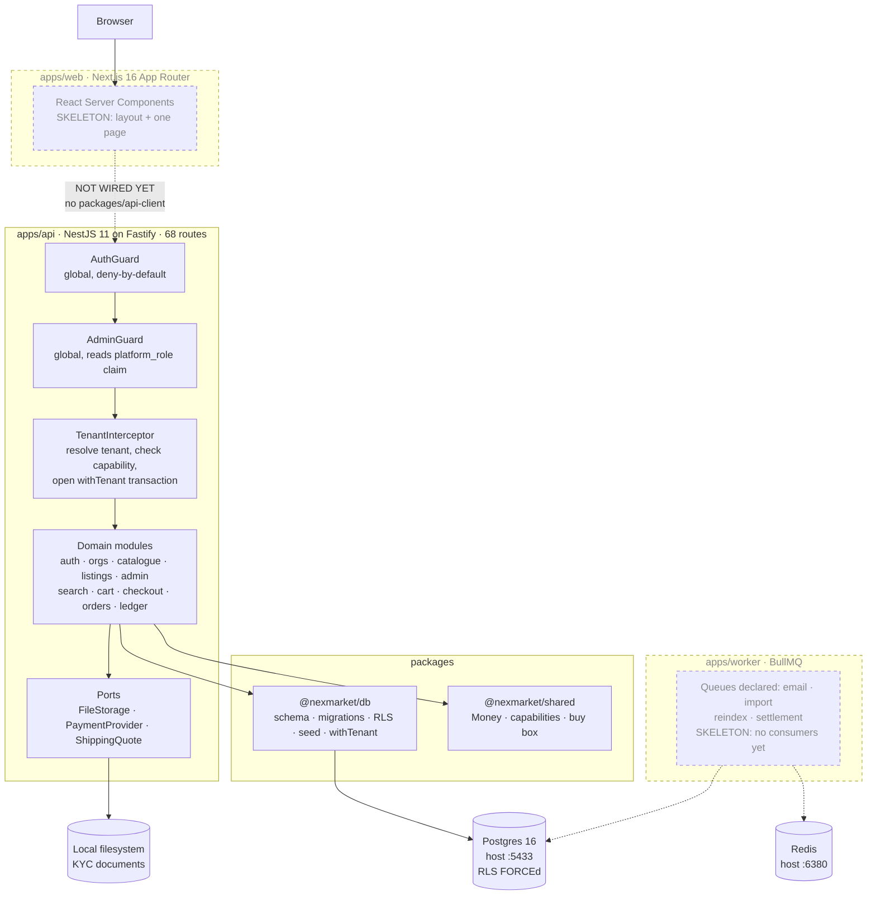

**What is real:** the API, the database, the whole tenancy and catalogue and
discovery stack, and the storage port with a local-filesystem adapter.

**What is a skeleton, stated plainly:** `apps/web` renders one page and makes no
API call — there is no `packages/api-client` yet, because the OpenAPI document
it would be generated from only stabilised at the end of Phase 3. `apps/worker`
declares four queue names and consumes none of them. Both are Phase 4+ work and
neither is pretending otherwise.

**The browser never talks to the API directly**, by design (PRD §7.1): calls
originate server-side so the access token lives in an `httpOnly` cookie and
never reaches JavaScript. That property is already true of the token design —
`configure-app.ts` registers the cookie plugin in the one place both `main.ts`
and the e2e suite build their adapter — it is only the caller that is missing.

---

## 2. The request pipeline

This is the most load-bearing and least obvious part of the system. **Guards run
before every interceptor**, always, which decides where each check can live.

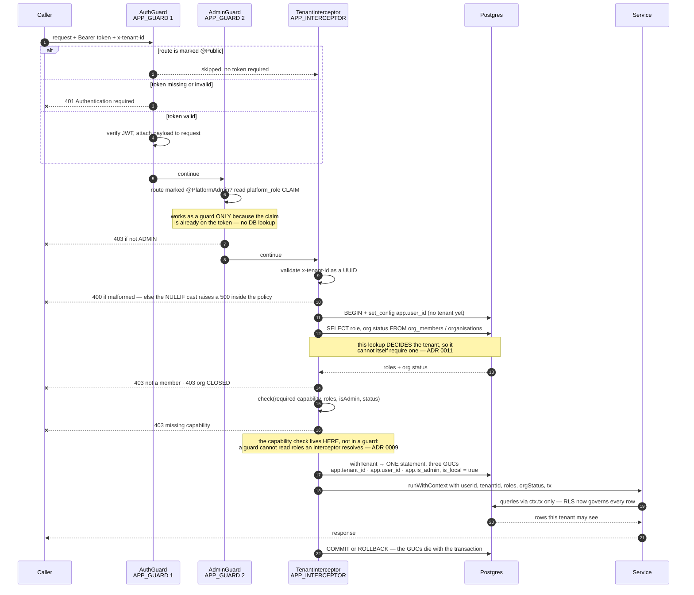

### Why each check sits where it does

| Check | Mechanism | Why not elsewhere |
|---|---|---|
| Authentication | `AuthGuard`, `APP_GUARD` #1 | Global so a new controller is **closed by default**; opting in per controller fails open the first time someone forgets |
| Platform admin | `AdminGuard`, `APP_GUARD` #2 | `platform_role` is a token claim `AuthGuard` already attached — no context needed. Registration order is load-bearing: before `AuthGuard` it would read `undefined` and refuse every admin |
| Tenant resolution | `TenantInterceptor` | Needs a transaction, and must run a query with `app.user_id` set but **no** tenant |
| Capability | inside `TenantInterceptor` | Guards run first, so a guard cannot see roles the interceptor resolves. Registering `CapabilityGuard` as an `APP_GUARD` made every gated route a 500 — ADR 0009 |
| Row visibility | Postgres RLS policies | An application filter is one forgotten `WHERE` away from a cross-tenant leak |

`CapabilityGuard` is still a class and still registered — as a **plain
provider**, called by the interceptor. It stayed a class so its logic is unit
testable in isolation; it is not an `APP_GUARD` for the reason above.

### Rules that follow

- Services take their transaction from `getRequestContext().tx`, **never** a
  `db` handle. GUCs are transaction-local, so any other connection carries no
  tenant context at all. `getRequestContext()` **throws** outside a request
  rather than falling back to something plausible.
- Never import `db` or `pool` from `@nexmarket/db`. A lint rule enforces it. Two
  sanctioned exceptions exist, both liveness-only and both commented at the
  import: the boot probe in `main.ts` and `HealthService`.
- **19 of the 68 route handlers** opt out with `@Public()` — 10 reads and
  9 writes: 4 auth, 2 Google OAuth, 3 catalogue reads, 3 search reads, 1 health,
  and — new in Phase 4 — 5 cart routes and the payment webhook. Those five are the first public
  **writes** in the system, so the allowlist is now split into `PUBLIC_READS`
  and `PUBLIC_WRITES` and the test demands a written justification for each
  write: a public read exposes data the database has already made public, while
  a public write lets an anonymous caller change server state. `route-coverage.e2e.test.ts` reflects over every
  registered Fastify route and fails if a new one is public without being on an
  explicit allowlist, so "public" is a decision someone made, not a default
  someone inherited.

---

## 3. Tenancy and isolation

### 3.1 Deciding what a new table is

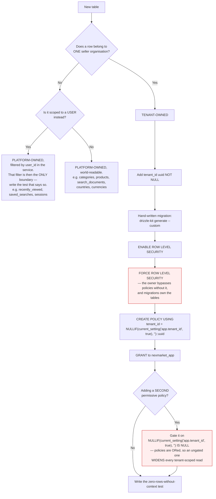

### 3.2 The three silent failures

Each of these reduces RLS to decoration, and **none of them raises an error**.

| # | Mistake | What actually happens |
|---|---|---|
| 1 | A session-level `SET` instead of `set_config(..., true)` | The value persists on the **pooled connection**. The next request — possibly another tenant's — inherits it |
| 2 | `ENABLE` without `FORCE ROW LEVEL SECURITY` | The table owner bypasses every policy, and migrations own the tables |
| 3 | Connecting as a role with `BYPASSRLS` | Every policy is ignored regardless. Neon's default `neondb_owner` carries it |

Hence: `DATABASE_URL` connects as `nexmarket_app` (**NOBYPASSRLS**),
`DATABASE_MIGRATION_URL` connects as the owner, which has the DDL rights the app
role deliberately lacks. `rls_probe` is a canary table with no business meaning —
it exists so a test can prove isolation without depending on any domain table.
Keep it.

### 3.3 The OR trap, which has now bitten twice

Postgres **ORs** permissive policies. A second policy on a tenant-owned table
therefore widens every tenant-scoped read, and the symptom looks like anything
but a policy bug.

| Table | Policy | What leaked | Fixed in |
|---|---|---|---|
| `org_members` | `own_membership` | Every tenant-scoped read also returned the caller's rows **from other tenants** | migration `0006` |
| `listings` | `public_active_offers` | Every seller's live prices would appear inside every other seller's console | migration `0008` |
| `orders` | `own_orders` | Every seller would see orders placed by any user sharing their user id — and after Phase 11's impersonation that is not hypothetical | migration `0012` |

Both fixes are the same shape: gate the extra policy on
`NULLIF(current_setting('app.tenant_id', true), '') IS NULL`, so it applies only
while **no tenant is selected**. `own_membership` also deliberately has **no
`WITH CHECK`** — that is what stops a user granting themselves a membership.

**Assume any new second policy has this bug until a test says otherwise.**

### 3.4 The three GUCs

`TenantContext` carries **three** values, and `withTenant` sets one GUC each, in
a single statement:

```sql
SELECT set_config('app.tenant_id', $1, true),
       set_config('app.user_id',   $2, true),
       set_config('app.is_admin',  $3, true);
```

`app.user_id` exists because of a bootstrap ordering problem: `org_members` must
answer *"which organisations does this caller belong to?"* **before** any tenant
is known, and the lookup that decides `tenant_id` cannot itself require
`tenant_id` (ADR 0011).

Collapsing three round trips into one was found while chasing the Phase 3 search
budget and is the cheapest millisecond in the codebase — it applies to **every
request in the system**, not only search.

### 3.5 The two sanctioned escapes

Exactly two operations move `app.tenant_id` outside `withTenant`. Both live in
`common/tenant-scope.ts`, both are transaction-local, both restore in a
`finally`.

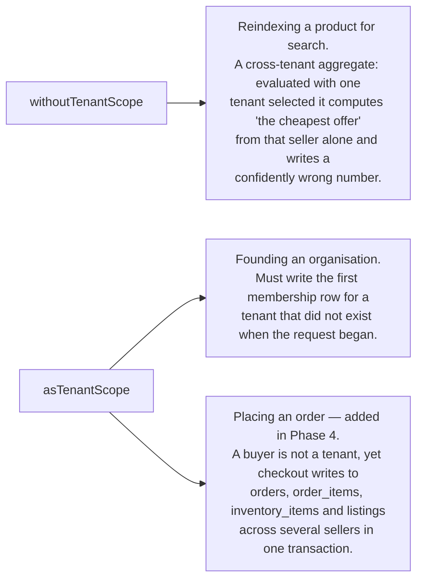

**Phase 4 considered and rejected a fourth.** The ledger also spans tenants —
one capture posts against two sellers and the platform — and the obvious fix was
another escape. Asking the question this section demands gave a better answer:
the ledger is the **platform's** books, not any seller's data, so it carries no
row-level security at all and the boundary is an `owner_org_id` filter in the
service. See §4 and ADR 0016.

The checkout escape passes the safety rule: the seller id is
`listings.tenant_id`, read from the database inside the transaction. **The buyer
chose a listing, never a tenant.** The alternatives are recorded in ADR 0017 —
running checkout as a platform admin would hand a buyer's transaction every
tenant's rows, and a buyer-insert policy on `orders` would let a buyer forge an
order that a seller's fulfilment queue would then read.

`withoutTenantScope` cannot be used to widen a tenant's view of its own private
rows: with no tenant selected, `DRAFT` and `PAUSED` listings are invisible to
everyone. `asTenantScope` is safe only for an id **this transaction produced** —
never a caller-supplied one, which is exactly the authorisation check the
interceptor exists to perform.

**Before adding a third, ask whether the work is genuinely not tenant-scoped, or
whether it is tenant-scoped work being done from the wrong place.** It has been
the second more often.

---

## 4. Data model

21 tables across 11 migrations. Ownership is the thing to read first.

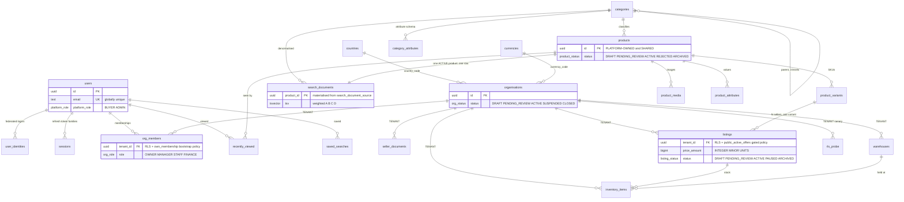

### Ownership, and why each way

| Ownership | Tables | Reason |
|---|---|---|
| **Tenant-owned** — `tenant_id`, RLS `ENABLE` + `FORCE` | `org_members`, `seller_documents`, `listings`, `inventory_items`, `warehouses`, `orders`, `order_items`, `rls_probe` | These *are* one seller's private data |
| **Platform-owned, world-readable** — no `tenant_id`, no RLS | `categories`, `category_attributes`, `products`, `product_variants`, `product_media`, `product_attributes`, `search_documents`, `countries`, `currencies` | A catalogue entry shared by competing sellers **is the point** (PRD 8.3). `search_documents` describes already-public products |
| **Platform-owned, org-scoped in the service** | `ledger_accounts`, `ledger_entries`, `transactions`, `payment_intents`, `payment_events` | The platform's books. One capture posts against two sellers **and** the platform in one transaction, which no tenant GUC can express. A seller reads their payable through `owner_org_id`, and `balanceFor` takes it as a **required** argument so omitting it is a type error — ADR 0016 |
| **Platform-owned, user-scoped in the service** | `users`, `user_identities`, `sessions`, `recently_viewed`, `saved_searches`, `carts`, `cart_items`, `addresses` | Buyers are not tenants. The `user_id` filter is then the **only** boundary, so it appears in every method rather than in a helper somebody could forget — and there is a test that one user cannot read or delete another's saved search |

That identity is deliberately un-RLS'd is a **decision, not an omission**, and
there is a test asserting it.

### Money

`type Money = { amount: number; currency: string }` where `amount` is **integer
minor units**. No floats anywhere in a pricing, tax, discount, shipping or
ledger path. `listings.price_amount` is `bigint`, never `numeric` and never a
float.

The legacy server did `parseInt(price * 100)`, which truncates. That bug is what
`@nexmarket/shared` exists to make unrepresentable. `allocate()` — which splits
one payment across sellers without losing a minor unit — is at 100% coverage and
is what the Phase 4 ledger will be built on.

### Migrations

`pnpm db:push` **runs migrations**; it does not run `drizzle-kit push`, which
diffs the schema and cannot express `CREATE POLICY`, `FORCE ROW LEVEL SECURITY`
or grants. The name is kept because the PRD and README document it. Do not "fix"
it into a real push (ADR 0007).

**Drizzle silently ignores any migration not listed in
`migrations/meta/_journal.json`.** A hand-dropped `.sql` file sits in the repo
looking applied while never running. Always use
`drizzle-kit generate --custom`, which writes the file, the journal entry and
the snapshot together.

| # | Migration | Adds |
|---|---|---|
| 0000–0001 | base + `rls_probe` policies | The RLS shape everything else copies |
| 0002 | identity tables | `users`, `user_identities`, `sessions` |
| 0003–0004 | membership | `org_members`, `seller_documents` + RLS |
| 0005 | session families | refresh-token rotation |
| 0006 | `own_membership` bootstrap-only | **fixes the first OR-trap leak** |
| 0007–0008 | catalogue + RLS | `categories` (ltree), `products`, `listings`, `inventory_items`, `warehouses` |
| 0009–0010 | search | `search_documents` (pg_trgm), `search_document_source` view, GIN indexes |

---

## 5. Lifecycles

Both state machines are **tables, not `if` statements**. A transition absent
from the table is a 409, so adding a state is adding a row rather than hunting
for the conditionals that would otherwise have accumulated across three
services.

### Organisation — PRD 6.6

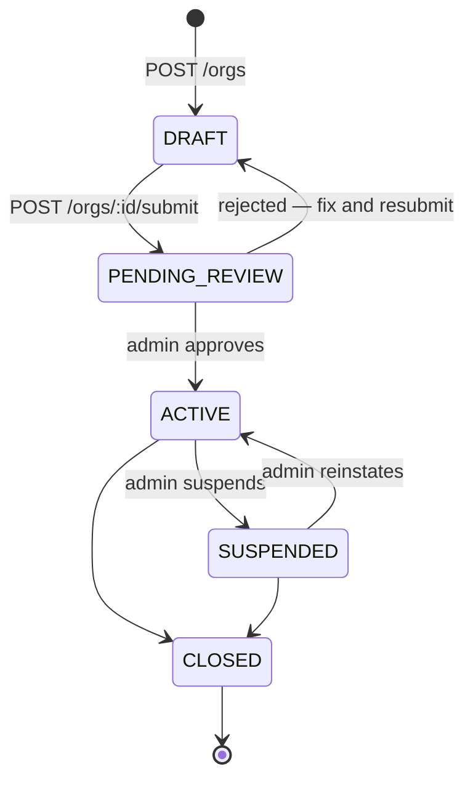

`PENDING_REVIEW → DRAFT` is *"rejected, fix it and resubmit"*, not a rollback.
`CLOSED` is terminal.

**Suspension is not a lock.** A `SUSPENDED` seller keeps read capabilities and
loses `product:write`, `settings:write`, `payout:write` and `member:write` —
they can still fulfil open orders, which is the PRD's requirement and the reason
capabilities are withdrawn individually rather than the session being killed. A
`CLOSED` org is a 403 at the interceptor.

### Listing — PRD 9.2

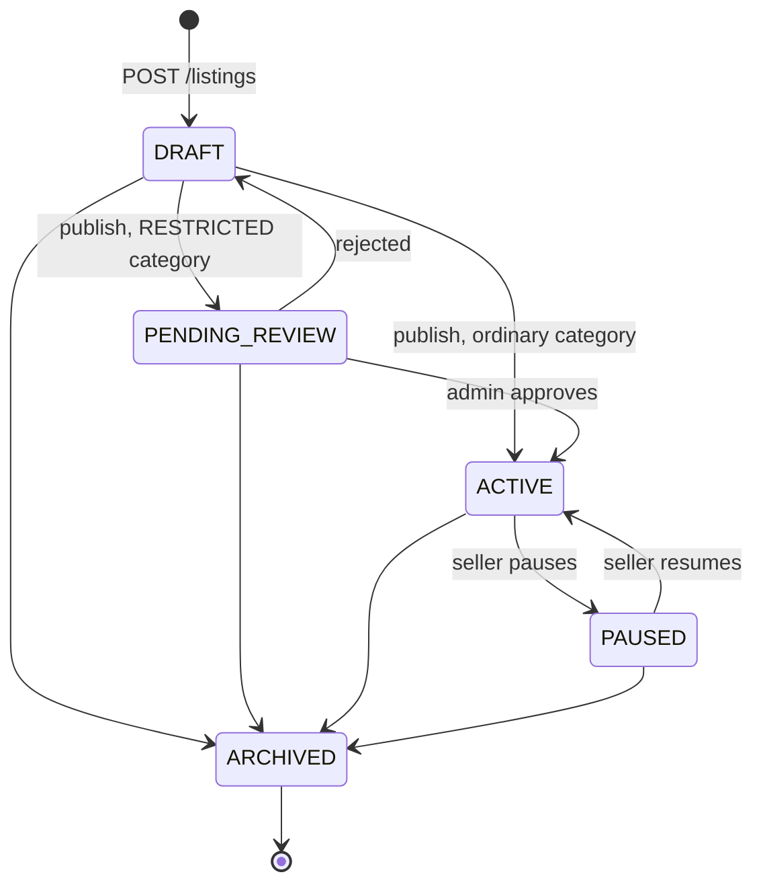

`publishTarget(categoryIsRestricted)` decides between the two publish edges. If
**every** listing needed review, `PENDING_REVIEW` would be a queue the platform
cannot staff; if **none** did, the state would be dead and the `RESTRICTED` flag
would do nothing until the Phase 4 age gate. So a listing in a `RESTRICTED`
category waits for an admin and everything else self-publishes — which is also
the honest reading of PRD 9.2, where it is *products* that are admin-moderated.

`ARCHIVED` is terminal on purpose: a seller who wants the offer back creates a
new one, so the price history of an archived offer stays readable.

---

## 6. The catalogue: products, listings, and the buy box

This is the single most important modelling decision in the project (PRD 8.3).

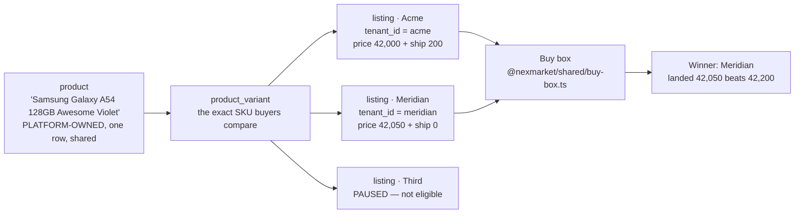

**Two sellers offering the same variant produce two rows.** A schema where the
seller owned the product would give two product pages, no comparison, and no buy
box — the Daraz/Amazon shape would be unreachable.

### Ranking

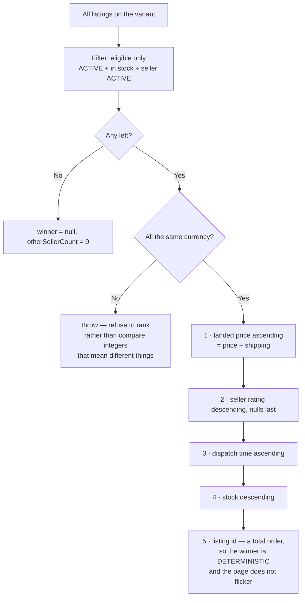

Two details that are the whole point:

- **Landed price, not sticker price.** The acceptance-test fixture is
  deliberately awkward — the seller with the *higher* sticker price wins,
  because their shipping is free. A fixture where the cheaper item also wins
  would pass against a buy box that ignored shipping entirely.
- **A total order.** Every tiebreak chain ends at the listing id, so there is no
  input for which two offers compare equal. Without that last rung the winner
  depends on row order and the product page changes on refresh.

`buy-box.ts` is at **100 % coverage including branches**, enforced as a
threshold. If it fails, add the missing test rather than lowering the threshold.

---

## 7. Discovery

### 7.1 One definition, three layers

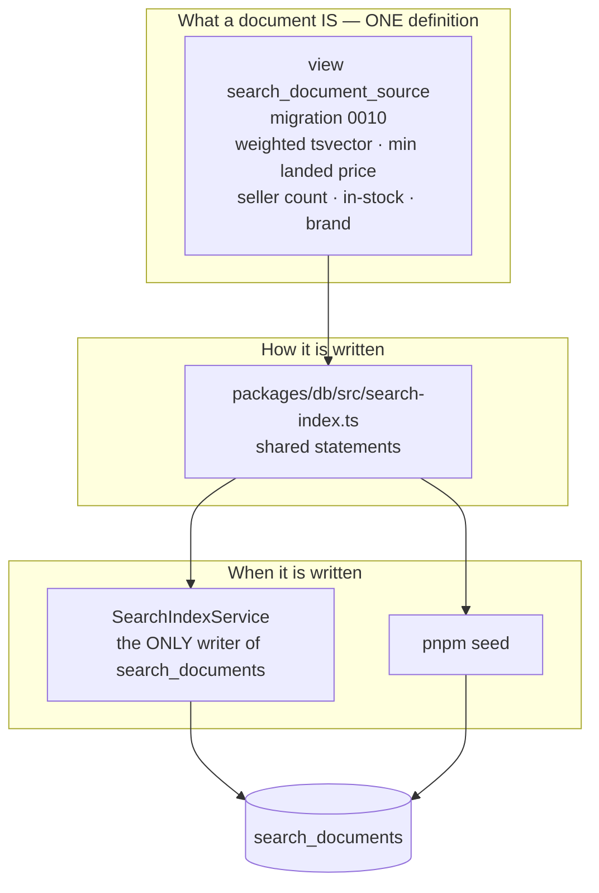

`search_documents` is a **real table**, one row per `ACTIVE` product.

- Rejected: a **materialized view** — it cannot refresh incrementally, so
  `REFRESH CONCURRENTLY` rebuilds all 50k rows to reflect one price change.
- Rejected: **triggers** — their appeal is that they cannot be forgotten, but
  they are invisible from the call site and fire inside RLS-scoped transactions.

An application-maintained table has exactly one failure mode: **a write path
that forgets to reindex.**

### 7.2 The write paths that must reindex

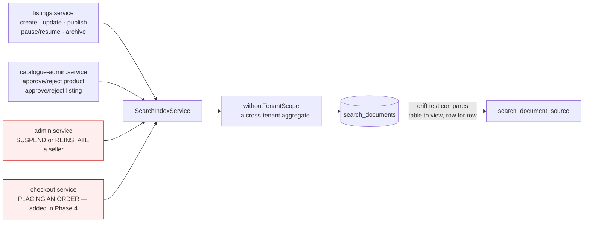

**Suspending a seller is the least obvious one**, and it is highlighted for that
reason: it withdraws every one of their offers, so the price and seller count
change on products the admin never looked at, and nothing about
`POST /admin/orgs/:id/suspend` looks like it touches search.

**Placing an order is the second least obvious, and it was nearly missed.** This
document listed three sites; cross-checking the Phase 4 plan against it found
the fourth before it shipped. Buying the last unit changes `in_stock`, and
`min_price_amount` and `seller_count` follow from eligible offers — so a
checkout that skipped the hook would leave a document advertising something
nobody can buy, with the API answering and every number plausible.

Checkout also must not write `listings.available_stock` itself. That column has
exactly one documented writer, `ListingsService.recomputeAvailableStock`, and a
denormalised column with two writers drifts under concurrency.

The drift test in `search.e2e` exercises every write path and then compares the
table against the view row for row. **That test is what makes this list
verifiable rather than a claim** — and it is why a stale document, which looks
completely normal because the API answers and the numbers are plausible, is a
red test instead of a support ticket.

**A write that changes what a buyer would FIND must reindex.**

### 7.3 The query path

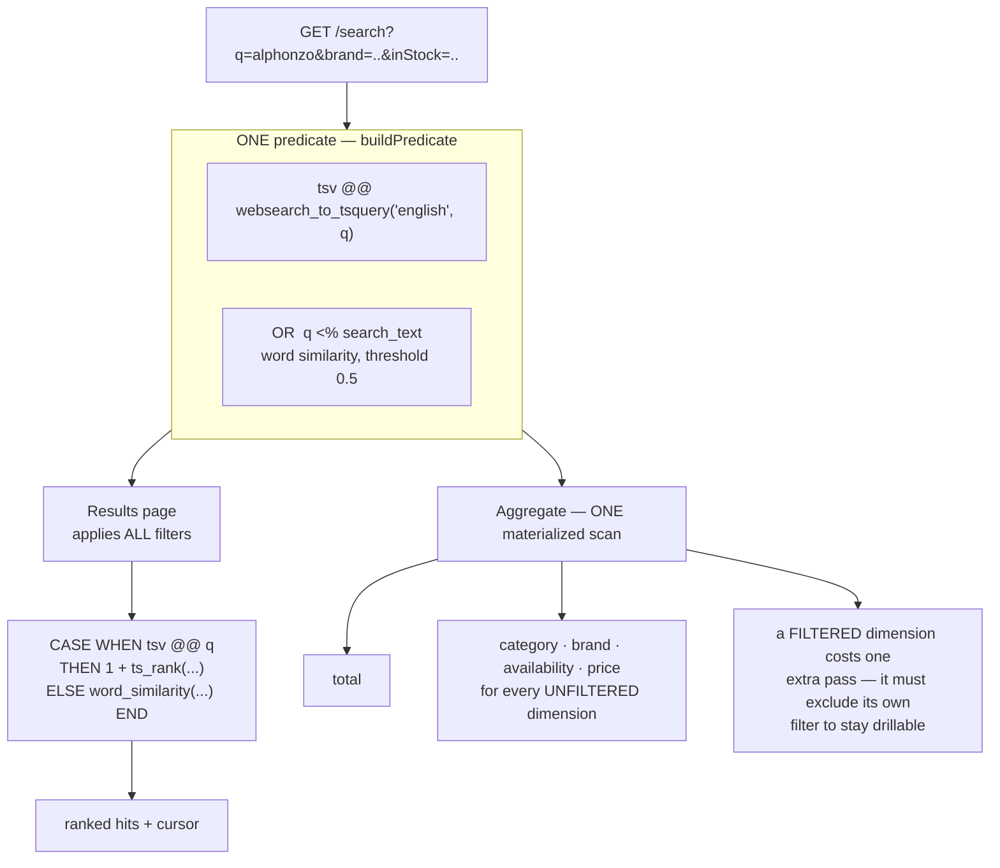

**Full-text OR trigram in one predicate — never a fallback.** The tempting design
is *"run FTS; if it returns too little, run trigram instead"*. Rejected: the two
produce different result sets, so the facet counts would describe a different
query than the results, and the exactness criterion fails on any borderline
search.

**`<%`, not `%`.** `%` compares the query against the *whole* document, so
`alphonzo` against `"Alphonso Mango Crate Verdant Fresh Produce Rangpur"` scores
far below any usable threshold — typo tolerance silently worked only for short
documents. `<%` asks whether the query resembles a continuous *extent* of the
text, which is the question a misspelled word actually poses. The threshold is a
**GUC** (`pg_trgm.word_similarity_threshold`), set transaction-locally; there is
no `set_word_similarity_limit` despite `set_limit` existing for `%`, and
reaching for the symmetrical-looking name is a 500 on every search.

**Facet exactness comes from sharing the predicate**, not from a reconciliation
step. Counts and results come from the same SQL in the same transaction. Each
dimension applies all of it *except its own filter* — that exclusion is the
drill-down semantic: with `Brand: Aurora` selected, the Brand facet must still
say how many results Samsung would give, or the filter can never be changed.

### 7.4 What the performance cost, measured

The criterion was missed by **4×** on first honest measurement. Every step of
closing it was a guess until it was measured:

| Change | Effect at 50k documents |
|---|---|
| `ts_rank_cd` → `ts_rank` | **1294 ms → 246 ms**. Cover density walks every match's term positions, and rank must be computed for every match before the top 20 are known. It also rewards term proximity, which barely exists in a four-word product name |
| Seven facet passes → one `MATERIALIZED` scan | Same predicate, same rows, computed once |
| Sum of two ranking functions → one `CASE` | Half the function calls per row, **and** every exact match now outranks every typo match by construction |
| Three `set_config` round trips → one | Three round trips saved on **every request in the system** |

Net: p50 **96 ms → 36 ms**; the worst shape 1294 ms → a 120 ms median.

### 7.5 What is NOT proven

**PRD §11 asks for p95 < 300 ms. This repository does not prove that number, and
the test says so rather than asserting something it cannot support.**

Every query shape's median at 50k is 6–120 ms and its best case 4–108 ms. But
the harness — a Docker-hosted Postgres sharing a machine with the rest of the
suite — delivers multi-hundred-millisecond stalls to queries whose best case is
single-digit milliseconds. On consecutive runs of the same file:

```
run A   q=mango&inStock=true   median  15 ms   max  594 ms
run B   q=mango&inStock=true   median 527 ms   max 1143 ms
```

An 80× spread on one shape is the host, not the code. Asserting a raw p95 there
produces a test that fails on a busy machine and passes on an idle one, which is
worse than no test: **it teaches people to re-run it.**

So the benchmark asserts the **best observed latency per shape** — the figure
that reflects the query plan — **reports the full distribution on every run**,
and separately asserts the GIN indexes are used, so a dropped index fails with a
clear reason instead of showing up as a slow day. One real finding came out of
the jitter and is worth keeping: a large share of it was **connection
establishment**, so the suite warms the pool and a deployment should size its
pool minimum rather than discover this in production.

**Open: the p95 criterion needs a staging environment with dedicated hardware.**
Recorded here, in ADR 0015 and in the README as open, not as done.

The benchmark is also **not** in `pnpm test` — it has its own config, script and
CI job, because a benchmark sharing a database with eleven parallel test files
times the contention rather than the query. It failed exactly that way before it
was split out.

---

## 8. Module map

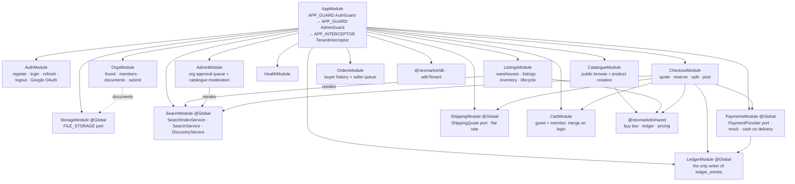

`SearchModule` and `StorageModule` are `@Global` because their one service each
is a cross-cutting dependency that would otherwise be re-imported by half the
modules in the tree — the reindex hook in particular belongs to *whoever writes*,
which is three different modules and will be more after Phase 4.

### Repository layout

```
apps/api        NestJS 11 on Fastify.  src/modules · src/common · src/config
apps/web        Next.js 16 App Router, server-first     [skeleton]
apps/worker     BullMQ consumers                        [skeleton]
packages/db     Drizzle schema, migrations, RLS, seed, withTenant
packages/shared Money, capabilities, buy box — framework-free primitives
packages/config tsconfig bases, eslint config, tailwind preset
scripts/mongo-etl  legacy MongoDB importer
archive/        legacy SPA, Express monolith, abandoned rewrite. Reference only.
```

`packages/db` and `packages/shared` are ESM, which forced `apps/api` to be ESM
too — TypeScript raises TS1479 on a static CommonJS-to-ESM import, and ESM
importing CJS always works, so the API moved. **All relative imports carry `.js`
extensions.** Decorators are unaffected (ADR 0005).

---

## 9. Runtime and environments

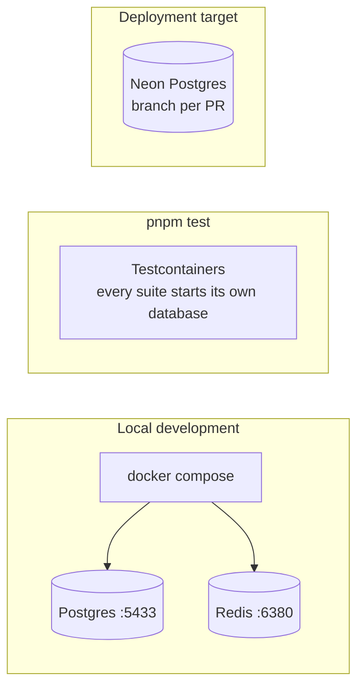

**Host ports are 5433 and 6380, not the defaults**, because other projects on
this machine bind 5432/6379. Container-internal ports are standard. Run
`docker ps` before adding any service to compose.

**Tests require Docker but no database configuration.** Every suite that touches
a database starts its own via Testcontainers, including the API suite, whose
`globalSetup` sets `DATABASE_URL` before any module reads it. The full suite
passes with `DATABASE_URL`, `DATABASE_MIGRATION_URL` and `REDIS_URL` all unset,
and that is verified rather than assumed. Keep it that way.

Two connection strings, two roles:

| Variable | Role | Rights |
|---|---|---|
| `DATABASE_URL` | `nexmarket_app` | **NOBYPASSRLS**, no DDL |
| `DATABASE_MIGRATION_URL` | owner | DDL, so it can `CREATE POLICY` and `FORCE` |

Neon is the deployment target and its default `neondb_owner` carries
`BYPASSRLS`, which is failure mode #3 in §3.2 — see `runbook/neon-setup.md`.

---

## 10. Where each invariant is enforced, and where it is proven

A design document that only says what *should* be true is a wish. Each row below
names the mechanism and the test.

| Invariant | Enforced by | Proven by |
|---|---|---|
| A new controller is closed and tenant-scoped | Global `APP_GUARD` + `APP_INTERCEPTOR` | `route-coverage.e2e` — reflects over every Fastify route against a `@Public()` allowlist |
| Missing tenant context returns **zero** rows, never all rows | `NULLIF(current_setting(...), '')::uuid` in every policy | `catalogue-rls.test`, `membership-rls.test` |
| RLS is `FORCE`d, not merely enabled | migrations | `migrations.test` reads `pg_class.relforcerowsecurity` |
| A second policy does not widen tenant reads | the `IS NULL` gate in 0006 / 0008 | tenancy + catalogue RLS suites, **mutation-verified** by deleting the gate and watching them fail |
| Two tenants concurrently see only their own rows | transaction-local GUCs | `tenant-context.test` — 40 interleaved requests |
| Seller A cannot edit seller B's listing | RLS on `listings` | `listings.e2e` — and B's row is asserted unchanged after the attempt |
| Two sellers on one product page, correct buy-box winner | `buy-box.ts` | `catalogue.e2e` + 100 % branch coverage on the module |
| Facet counts equal what filtering by them returns | one shared predicate | `search.e2e` — asserted in a loop over every value of every dimension, not spot-checked |
| The search index agrees with its source | `SearchIndexService` is the only writer | `search.e2e` drift test, after exercising every write path |
| One user cannot read another's saved searches | `user_id` filter in every method | `search.e2e` — there is no policy behind that table, so the filter *is* the boundary |
| Every ledger transaction sums to zero | `assertBalanced` **and** a deferred constraint trigger **and** a CHECK | `ledger.test` (pure, 100 %) · `ledger-constraints.test` — which asserts the INSERTs succeed and the **commit** fails |
| The ledger is append-only | an explicit `REVOKE UPDATE, DELETE`, because the `GRANT` was a no-op under 0001's default privileges | `ledger-constraints.test` — SQLSTATE 42501 |
| A cart with 3 sellers produces 3 orders | one `payment_intent`, N `orders` | `checkout.e2e` |
| Price tampering rejected | `cart_items` has no money column; `expectedTotal` is compared, never used | `cart.e2e` reflects over the schema · `checkout.e2e` asserts **zero orders and zero ledger entries** after a tampered confirm |
| The webhook is the only writer of payment status | the port's `initialStatus` is typed so no adapter *can* return a settled status | `checkout.e2e` — intent still `REQUIRES_PAYMENT` after a successful confirm |
| A gateway retry captures once | `UNIQUE (provider, provider_event_id)`, inserted before applying | `checkout.e2e` — same event twice, one transaction |
| Two checkouts cannot take the last unit | conditional `UPDATE` with `FOR UPDATE` **and** the predicate repeated outside it | `checkout.e2e` — exactly one 201 and one 409 |
| A buyer sees their orders across sellers; a seller sees only their own | `own_orders`, gated on no tenant | `orders-rls.test`, mutation-verified |
| No float in any money path | `Money` in `@nexmarket/shared`, `bigint` columns | 100 % coverage threshold on `money.ts`, `ledger.ts`, `pricing.ts` |
| Never read a role name to authorise | `@RequireCapability(...)` + capability matrix as data | 100 % coverage threshold on `capabilities.ts`, ADR 0013 |

Coverage thresholds are enforced at 100 % on `money.ts`, `capabilities.ts`,
`buy-box.ts`, `ledger.ts`, `pricing.ts`, `tenant-context.ts` and
`assert-driver.ts`. **If one fails, add the
missing test rather than lowering the threshold.**

**381 tests** — api 180 · db 95 · shared 84 · mongo-etl 19 · worker 3 — plus a
**4-test search benchmark** run separately.

---

## 11. What is not built, and where it plugs in

```mermaid
graph LR
    subgraph DONE["Phases 0-4 · built"]
        P0["0 Foundation"] --> P1["1 Tenancy & Identity"] --> P2["2 Catalogue"] --> P3["3 Discovery"] --> P4["4 Cart, Checkout & Ledger"]
    end
    subgraph NEXT["Phase 5 · next"]
        P5N["Orders & Fulfilment"]
    end
    subgraph LATER["Phases 5-12"]
        P5["5 Orders & Fulfilment"] --> P6["6 Logistics"] --> P7["7 Trust"] --> P8["8 Post-purchase"]
        P8 --> P9["9 Engagement"] --> P10["10 Seller tooling"] --> P11["11 Admin & Ops"] --> P12["12 Platform quality"]
    end
    P4 --> P5N --> P5

    style NEXT stroke-dasharray: 5 5
    style LATER stroke-dasharray: 5 5
```

### Phase 5 — the seams already cut for it

| Phase 5 needs | Already exists |
|---|---|
| A seller order queue, tenant-scoped | `orders` and `order_items` under RLS, and `GET /seller/orders` already reads them |
| "Seller sees only their items on a shared order" | Already true at the database: `order_items` carries the same policies as `orders` |
| Partial fulfilment settling in the ledger | An append-only, reversal-based ledger that needs no schema change to express it |
| An order state machine | `orderStatus` has the three states Phase 4 can reach; Phase 5 adds the rest as rows in a transition table, the shape `orgs/lifecycle.ts` and `listings/lifecycle.ts` already use |
| Releasing stock on cancellation | The webhook's failure path already does exactly this |

### A correction this phase made to §11 itself

An earlier version of this document listed `allocate()` as the Phase 4 seam for
"splitting one payment across sellers without losing a minor unit". **It was
wrong, and the Phase 4 audit caught it.** Each seller's subtotal is computed
independently from their own `order_items`, and commission is a percentage *of
that subtotal*, so the parts sum exactly by construction — there is no remainder
to distribute.

`allocate()` earns its place at the first amount computed **once at cart level
and then split**: a cart-wide promotion (Phase 9) or a partial refund against a
multi-seller order (Phase 8). Phase 4 needs `multiply`, which already rounds
half away from zero. The function was not forced into the commission path to
make the old sentence true.

### Deliberate absences, with reasons

- **`packages/api-client`** — generated from OpenAPI. It is what will wire
  `apps/web` to the API.
- **A Stripe adapter.** The PRD names three payment adapters; two ship, mock and
  cash on delivery. Building one against an account that does not exist produces
  code no test can exercise. The port is the seam: one class plus one line in
  `payments.module.ts`. Recorded as a deviation, not as done — ADR 0018.
- **Shipping is a flat rate** and **tax is one rate per country.** Zones, rate
  cards, dimensional weight and delivery slots are Phase 6; the
  `ShippingQuoteProvider` port is where they land.
- **COD accrues but is never collected.** Phase 4 posts to `COD_RECEIVABLE`;
  Phase 6 clears it, because that is where the courier hands the cash over.
- **Worker consumers** — the four queue names exist; nothing consumes them until
  there is work to enqueue.
- **"Frequently bought together"** and a **best-selling sort** — both need order
  history (Phase 4). A random sample presented as a recommendation would be
  worse than its absence, and the sort enum does not offer an option it cannot
  honour.
- **Saved-search alerts** — the searches are saved; nothing emails anyone.
  Notifications are Phase 9, and the schema deliberately has no
  `alerts_enabled` column that does nothing.
- **Search is English-stemmed.** PRD 10.6 owns i18n; the analyser name appears
  in exactly one place, so a Bangla configuration is a change to the view plus a
  reindex.

---

## 12. Related documents

- `PRD-marketplace-migration.md` — the specification, and the phase roadmap
- `architecture/README.md` — 15 ADRs, one per decision that would otherwise have
  to be re-derived from the code
- `architecture/0003` — **read first** if you are touching the database
- `architecture/0009` — read before touching guards, the interceptor, or
  anything that resolves a tenant
- `architecture/0014`, `0015` — the catalogue split and the search numbers
- `runbook/neon-setup.md` — the `BYPASSRLS` hazard on a managed Postgres
- `superpowers/plans/` — the per-phase implementation plans, including the
  decisions taken mid-phase
